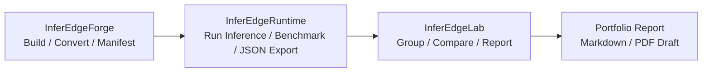

# InferEdgeLab

**GitHub description:** Analysis/API layer for end-to-end Edge AI inference validation, reports, jobs, and deployment decisions.

InferEdge is an end-to-end Edge AI inference validation pipeline that connects build provenance, C++ runtime execution, Lab analysis/deployment decision, and optional deterministic diagnosis evidence.

## Portfolio Summary

**한국어 5줄 요약**
- InferEdgeLab은 단순 benchmark viewer가 아니라, Runtime benchmark 결과를 분석해 compare/report/API/job result/deployment decision까지 생성하는 Edge AI inference validation layer입니다.
- InferEdge 전체 pipeline은 Forge build provenance -> Runtime real execution -> Lab analysis/API/job/deployment_decision -> optional AIGuard diagnosis evidence로 이어집니다.
- Lab은 Forge metadata/manifest, InferEdge-Runtime C++ 실행 결과, optional AIGuard guard_analysis를 하나의 검증 evidence bundle로 정렬합니다.
- 최근 `yolov8n.onnx` manual smoke에서 Lab -> C++ Runtime CLI -> ONNX Runtime CPU execution -> Lab job result ingestion 경로와 Jetson Orin Nano Forge manifest + TensorRT engine artifact -> C++ Runtime execution 경로가 검증되었습니다.
- 현재 상태는 portfolio-grade pipeline foundation이며, production worker daemon, persistent queue/database, file upload, frontend, auth/billing은 future work로 분리되어 있습니다.

**English 5-line summary**
- InferEdgeLab analyzes runtime benchmark results and produces comparison reports, API responses, async job results, and deployment decisions.
- It is part of an end-to-end pipeline: Forge build provenance -> Runtime real execution -> Lab analysis/decision -> optional AIGuard diagnostic evidence.
- Lab integrates InferEdgeForge metadata, InferEdge-Runtime C++ outputs, and optional InferEdgeAIGuard rule/evidence findings.
- Real manual smokes validated Lab -> C++ Runtime -> ONNX Runtime CPU execution on macOS and Forge manifest + TensorRT engine artifact execution on Jetson Orin Nano.
- The current scope is a portfolio-grade pipeline foundation, not a fully productionized SaaS platform.

> InferEdgeLab is an edge AI inference validation CLI that turns raw benchmark results into structured, reproducible, and accuracy-aware deployment decisions across different runtimes and hardware.  
> InferEdgeLab turns benchmark runs into reproducible, comparable **deployment-ready validation evidence**.  
> Validated on real hardware: RKNN (Odroid M2) and TensorRT (Jetson)  
> Cross-precision benchmarking on RKNN showed up to **~51% latency reduction with INT8**, with structured comparison and `acceptable_tradeoff` classification across YOLOv8n/s/m

InferEdgeLab is designed for workflows where **latency, accuracy, and risk must be evaluated together**.

InferEdgeLab is a CLI-first validation system that treats benchmarking as a **continuous validation workflow**, not a one-off script.

Instead of a single latency number, InferEdgeLab answers:

- Is the new result actually faster under the **same conditions**?
- Is INT8 a valid trade-off or a **risky degradation**?
- Can benchmark results be **reused** in CI and reports?

---

## InferEdge Pipeline Overview

InferEdge is organized as one product-style Edge AI inference validation pipeline:

```text
ONNX model
-> InferEdgeForge build
-> metadata / manifest / worker runtime summary
-> InferEdgeRuntime validation / result export
-> InferEdgeLab compare / API / job workflow / deployment_decision
-> optional InferEdgeAIGuard provenance diagnosis
-> deploy / review / blocked decision
```

Repository roles are deliberately split:

- **InferEdgeForge:** build artifact and provenance generation.
- **InferEdgeRuntime:** C++ execution, profiling, result export, and worker response boundary.
- **InferEdgeLab:** compare/report/API/job workflow and final deployment decision ownership.
- **InferEdgeAIGuard:** optional rule + evidence based failure and provenance diagnosis.

Implemented today: Lab API response contract, `/api/compare`, `/api/analyze` in-memory jobs, worker request/response mappings, Runtime dry-run validation/export, Forge worker/runtime summary, AIGuard provenance mismatch diagnosis, Lab decision/report evidence smoke coverage, dev-only Lab -> Runtime ONNX Runtime smoke using `yolov8n.onnx`, manual Jetson TensorRT Runtime smoke using a Forge manifest plus TensorRT engine artifact, and Runtime source-model identity preservation for compare-ready TensorRT engine results.

Runtime identity polish: when a Forge manifest is applied, Runtime now preserves the manifest `source_model.path` identity for comparison naming. A TensorRT artifact such as `model.engine` can therefore keep `compare_model_name=yolov8n` and `compare_key=yolov8n__b1__h640w640__fp32` instead of degrading to `model__...`. This is provenance/compare-readiness polish, not production SaaS infrastructure.

Not implemented yet: real worker daemon, full automated Forge/Runtime execution from production Lab workers, DB/Redis/queue, file upload, SaaS frontend, and production auth/billing/deployment controls.

Portfolio entry points: [portfolio submission](docs/portfolio/inferedge_portfolio_submission.md) · [resume/interview summary](docs/portfolio/inferedge_resume_interview_summary.md) · [1-page architecture summary](docs/portfolio/inferedge_1page_architecture.md) · [pipeline status](docs/portfolio/inferedge_pipeline_status.md)

Interview one-liner: **InferEdge is an end-to-end inference validation pipeline that converts, runs, compares, diagnoses, and decides whether an edge AI model candidate is ready to deploy.**

Final interview angle: InferEdge has both macOS ONNX Runtime CPU smoke and Jetson Orin Nano TensorRT smoke evidence, while production worker daemon, persistent queue/database, frontend, auth, and billing remain future work.

---

## Real Inference Benchmark Result

YOLOv8n was validated with a real OpenCV image-input benchmark: InferEdgeRuntime generated compare-ready JSON results, and InferEdgeLab automatically grouped and compared them by `compare_key` and `backend_key`.

| Backend | Input Mode | Mean ms | P99 ms | FPS |
|---|---|---:|---:|---:|
| TensorRT Jetson | image | 9.9375 | 15.5231 | 100.6293 |
| ONNX Runtime CPU | image | 45.4299 | 49.2128 | 22.0119 |

TensorRT Jetson was 4.6x faster than ONNX Runtime CPU in this real image input benchmark.
The benchmark uses end-to-end Runtime latency, not trtexec GPU-only latency.
The full pipeline portfolio summary is available at [docs/portfolio/inferedge_pipeline_portfolio.md](docs/portfolio/inferedge_pipeline_portfolio.md), and the detailed Runtime comparison report is available at [docs/portfolio/runtime_compare_yolov8n.md](docs/portfolio/runtime_compare_yolov8n.md).

---

## Reproducible Review Flow

For a quick review, follow this order:

1. Read the pipeline summary: [docs/portfolio/inferedge_pipeline_portfolio.md](docs/portfolio/inferedge_pipeline_portfolio.md)
2. Check the real benchmark result: [docs/portfolio/runtime_compare_yolov8n.md](docs/portfolio/runtime_compare_yolov8n.md)
3. Review the current submission draft: [docs/portfolio/inferedge_portfolio_submission.md](docs/portfolio/inferedge_portfolio_submission.md)
4. Run Lab comparison with `compare-runtime-dir` if local InferEdgeRuntime JSON artifacts are available.

Raw Runtime JSON and generated benchmark reports are intentionally not committed because they are environment-dependent.
Instead, this README and the portfolio documents preserve validated benchmark numbers as stable review evidence.



Runtime measures. Lab compares. Portfolio documents explain the evidence.

---

## Sample Runtime Result

This is a compact example of the structured result shape that InferEdgeRuntime exports and InferEdgeLab groups by `compare_key` and `backend_key`.

```json
{
  "compare_key": "yolov8n__b1__h640w640__fp32",
  "backend_key": "tensorrt__jetson",
  "mean_ms": 9.9375,
  "p99_ms": 15.5231,
  "fps_value": 100.6293,
  "success": true,
  "status": "success",
  "extra": {
    "input_mode": "image",
    "input_preprocess": "opencv_bgr_to_rgb_resize_float32_nchw"
  }
}
```

---

## What InferEdgeLab Solves

### 1. Inconsistent Benchmark Comparisons

Most benchmark comparisons silently differ in batch size, input shape, or precision — leading to false improvements and missed regressions.

InferEdgeLab stores `run_config` and input shape as structured metadata and enforces **same-condition comparison**, explicitly separating `same-precision` and `cross-precision` semantics.

### 2. No Interpretation for Precision Trade-offs

Switching FP32 → INT8 changes both latency and accuracy, but most tools only show raw numbers.

InferEdgeLab computes latency delta + accuracy delta together and classifies the result:

- `acceptable_tradeoff`
- `caution_tradeoff`
- `risky_tradeoff`
- `severe_tradeoff`

### 3. Benchmark Results Are Not Reusable

Typical benchmarking is one-time execution with no structured storage.

InferEdgeLab saves all results as **structured JSON**, enabling `compare`, `compare-latest`, and `history-report` — reused across CLI, FastAPI, and CI pipelines.

---

## Architecture Snapshot

```
CLI / API → Service Layer → Structured Result → Compare / Report
```

**CLI Layer:** profile, compare, compare-latest, summarize, list-results, history-report, enrich, serve  
**Service Layer:** reusable validation logic  
**API Adapter Layer:** FastAPI read-only endpoints  
**Engine Layer:** ONNX Runtime CPU · TensorRT (Jetson) · RKNN (Odroid)

---

## Key Results (Real Hardware Validation)

InferEdgeLab was validated on real edge hardware using YOLOv8 models.

### Jetson TensorRT (Haeundae YOLOv8n)

InferEdgeLab can now consume externally produced Jetson TensorRT latency results and engine artifacts, generate Haeundae YOLOv8n detection accuracy payloads with `evaluate-detection`, attach them through `enrich-pair`, and report an accuracy-aware FP16 vs FP32 comparison.
In the recorded downstream comparison, FP16 was `8.8819ms` mean / `13.7437ms` p99 with `0.8037` mAP@50, while FP32 was `10.2869ms` mean / `18.1921ms` p99 with `0.8041` mAP@50; the Lab judgement was `tradeoff_slower` / `not_beneficial`.

### Odroid M2 (RKNN)

| Model | Precision | Mean Latency (ms) | P99 (ms) | Observation |
|---|---|---:|---:|---|
| YOLOv8n | FP16 | 72.4430 | 79.1559 | enriched runtime baseline |
| YOLOv8n | INT8 | 35.5771 | 45.3868 | -50.89% latency, acceptable_tradeoff |
| YOLOv8s | FP16 | 85.8169 | 109.4198 | enriched runtime baseline |
| YOLOv8s | INT8 | 49.9623 | 58.6213 | -41.78% latency, acceptable_tradeoff |
| YOLOv8m | FP16 | 171.9906 | 192.6720 | enriched runtime baseline |
| YOLOv8m | INT8 | 87.8136 | 111.5943 | -48.94% latency, acceptable_tradeoff |

### Interpretation

- INT8 quantization provided **~42–51% latency improvement** on RK3588 NPU across YOLOv8n/s/m
- Initial cross-precision runtime comparison is classified as `tradeoff_faster`
- Before accuracy attachment, the same runtime pair is classified as `unknown_risk`
- After attaching detection accuracy payloads through `enrich-pair`, the runtime pairs for `yolov8n`, `yolov8s`, and `yolov8m` are all reinterpreted as `acceptable_tradeoff`
- Primary metric (`map50`) improved across all three enriched pairs:
  - `yolov8n`: `0.7791 → 0.7977` (**+1.86pp**)
  - `yolov8s`: `0.7840 → 0.8090` (**+2.50pp**)
  - `yolov8m`: `0.7856 → 0.7975` (**+1.19pp**)
- Some secondary metrics such as `map50_95`, `f1_score`, and `precision` may still decline, which shows why deployment decisions should be based on an explicitly chosen primary metric rather than a single raw speed number

> This workflow demonstrates how a latency-only benchmark can be transformed into an accuracy-aware deployment decision without re-running the full profiling process.

---

## Proven in Practice

Validated on real edge hardware:

| Scope | Status |
|---|---|
| ONNX Runtime CPU profiling + structured result | ✅ |
| Jetson TensorRT repeated validation + report reuse | ✅ |
| Jetson TensorRT Haeundae YOLOv8n downstream accuracy enrichment and compare | ✅ |
| Odroid RKNN curated validation + cross-precision comparison | ✅ |
| Odroid RKNN enriched validation with accuracy-aware trade-off interpretation (`yolov8n/s/m`) | ✅ |
| FastAPI read-only adapter (service reuse) | ✅ |
| CI benchmark + validation gate | ✅ |

---

## Start Here

- [Benchmark reference table](BENCHMARKS.md)
- [InferEdge pipeline contract](docs/pipeline_contract.md)
- [InferEdge Portfolio Submission](docs/portfolio/inferedge_portfolio_submission.md)
- [InferEdge Resume/Interview Summary](docs/portfolio/inferedge_resume_interview_summary.md)
- [InferEdge 1-Page Architecture Summary](docs/portfolio/inferedge_1page_architecture.md)
- [InferEdge Pipeline Status](docs/portfolio/inferedge_pipeline_status.md)
- [YOLOv8n Runtime Comparison Report](docs/portfolio/runtime_compare_yolov8n.md)
- [Jetson TensorRT validation runbook](docs/validation/jetson_tensorrt_validation.md)
- [FastAPI API usage guide](docs/api/api_usage.md)
- [SaaS async job workflow contract](docs/api/saas_job_workflow.md)
- [Forge/Runtime worker integration contract](docs/api/worker_integration_contract.md)
- Legacy/reference portfolio notes: [pipeline portfolio summary](docs/portfolio/inferedge_pipeline_portfolio.md), [older PDF draft](docs/portfolio/inferedge_pipeline_portfolio_pdf.md), [EdgeBench-era design notes](docs/portfolio/edgebench_portfolio.md)
- [Project roadmap](Roadmap.md)

---

## End-to-End Demo

`scripts/demo_pipeline_full.sh` is the guided portfolio demo entrypoint for the full InferEdge flow: Forge -> Runtime -> Lab -> optional AIGuard.
By default it prints a safe demo summary and does not start a production worker daemon, queue, database, or SaaS worker.
It separates macOS Lab -> Runtime ONNX Runtime smoke from Jetson TensorRT manifest smoke and preserves the current SaaS-ready validation foundation scope.

```bash
bash scripts/demo_pipeline_full.sh
bash scripts/demo_pipeline_full.sh --help
bash scripts/demo_pipeline_full.sh --run-jetson-command-print
```

---

## 🚀 Quickstart (3-minute demo)

### Clone and install

```bash
git clone https://github.com/gwonxhj/InferEdgeLab.git
cd InferEdgeLab

pip install poetry
poetry install
```

### Generate a toy model

```bash
poetry run python scripts/make_toy_model.py \
  --height 224 \
  --width 224 \
  --out models/toy224.onnx
```

### Profile

```bash
poetry run inferedgelab profile models/toy224.onnx \
  --warmup 10 \
  --runs 50 \
  --batch 1 \
  --height 224 \
  --width 224
```

### Compare

```bash
poetry run inferedgelab compare-latest \
  --model toy224.onnx \
  --engine onnxruntime \
  --device cpu
```

Optional Guard reasoning is available with `compare --with-guard` and `compare-latest --with-guard`.
InferEdgeAIGuard is an optional dependency; when it is installed, Lab appends Guard Analysis based on the compare result and judgement, and when it is not installed, compare still runs normally.
Compare and compare-latest also include a Deployment Decision that combines Lab judgement with Guard status into a deployable, review, blocked, or unknown release signal.

**Core workflow:**

```
profile → structured result → compare → report / CI
```

---

## Runtime Integration

InferEdgeLab can consume compare-ready JSON files produced by InferEdgeRuntime and compare them automatically at the directory level.
Runtime results are grouped by `compare_key`, then backend measurements are compared by `backend_key` using `mean_ms`.

```bash
poetry run inferedgelab compare-runtime-dir results/
```

To save the same grouped comparison as Markdown:

```bash
poetry run inferedgelab compare-runtime-dir results/ --report reports/runtime_compare.md
```

Example compare-ready Runtime fields:

```json
{
  "runtime_role": "runtime-result",
  "compare_key": "toy224__b1__h224w224__fp32",
  "backend_key": "onnxruntime__cpu",
  "mean_ms": 1.4
}
```

If the same `compare_key` also has a `tensorrt__jetson` result, `compare-runtime-dir` prints the grouped backend latencies and the fastest backend ratio.

### Portfolio Example

See [YOLOv8n Runtime backend comparison](docs/portfolio/runtime_compare_yolov8n.md) for a real example where InferEdgeRuntime produced ONNX Runtime CPU and TensorRT Jetson JSON results, and InferEdgeLab grouped them by `compare_key` and `backend_key` into a Markdown comparison report.
The YOLOv8n Runtime comparison report demonstrates a real OpenCV image-input benchmark, `compare_key` / `backend_key` automatic grouping, and the role split where Runtime generates JSON while Lab performs comparison and reporting.

---

## API Server Usage

### Run server

```bash
poetry run inferedgelab serve --host 127.0.0.1 --port 8000
```

### Health check

```bash
curl "http://127.0.0.1:8000/health"
```

### Endpoints

- `/health`
- `/api/list-results`
- `/api/summarize`
- `/api/history-report`
- `/api/compare`
- `/api/compare-latest`

More details: [FastAPI API usage guide](docs/api/api_usage.md)

---

## CI / Benchmarks

InferEdgeLab integrates benchmarking into CI:

- structured result reuse
- compare-based regression detection
- `compare-latest` automation
- CI validation gate
- benchmark evidence tracking

### Auto-Generated Benchmark Summary

<!-- EDGE_BENCH:START -->

> No auto-generated report summaries are available yet.

<!-- EDGE_BENCH:END -->

See: [Benchmark reference table](BENCHMARKS.md) · [Project roadmap](Roadmap.md)

---

## License

MIT License
