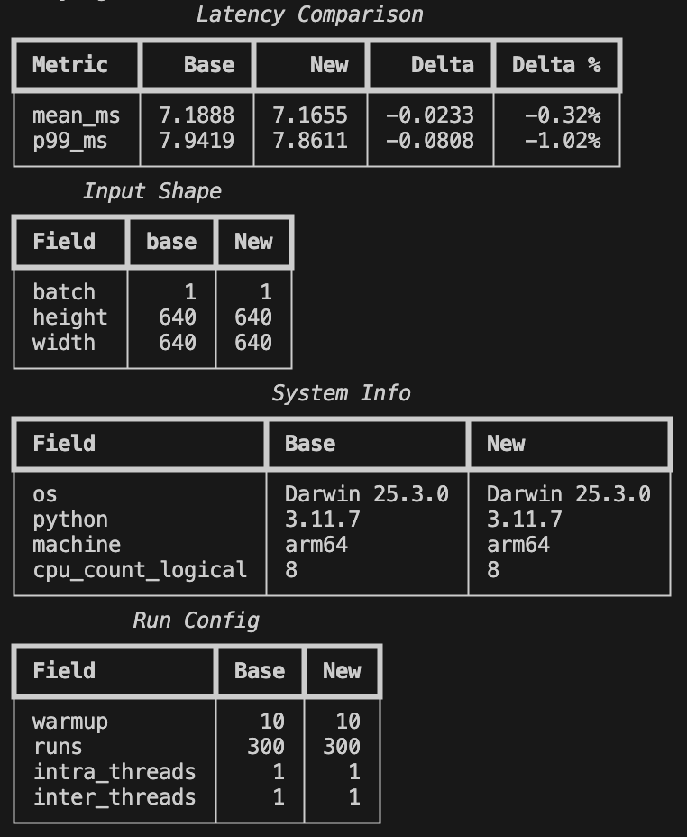
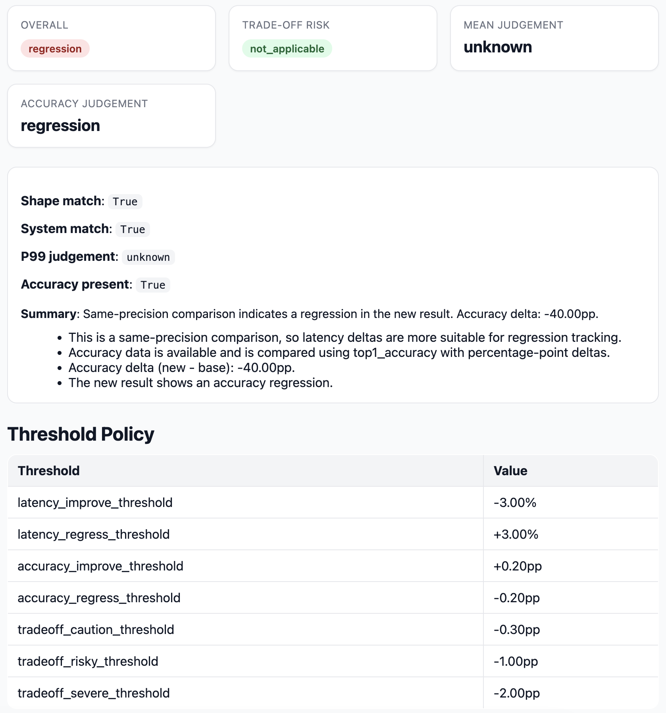
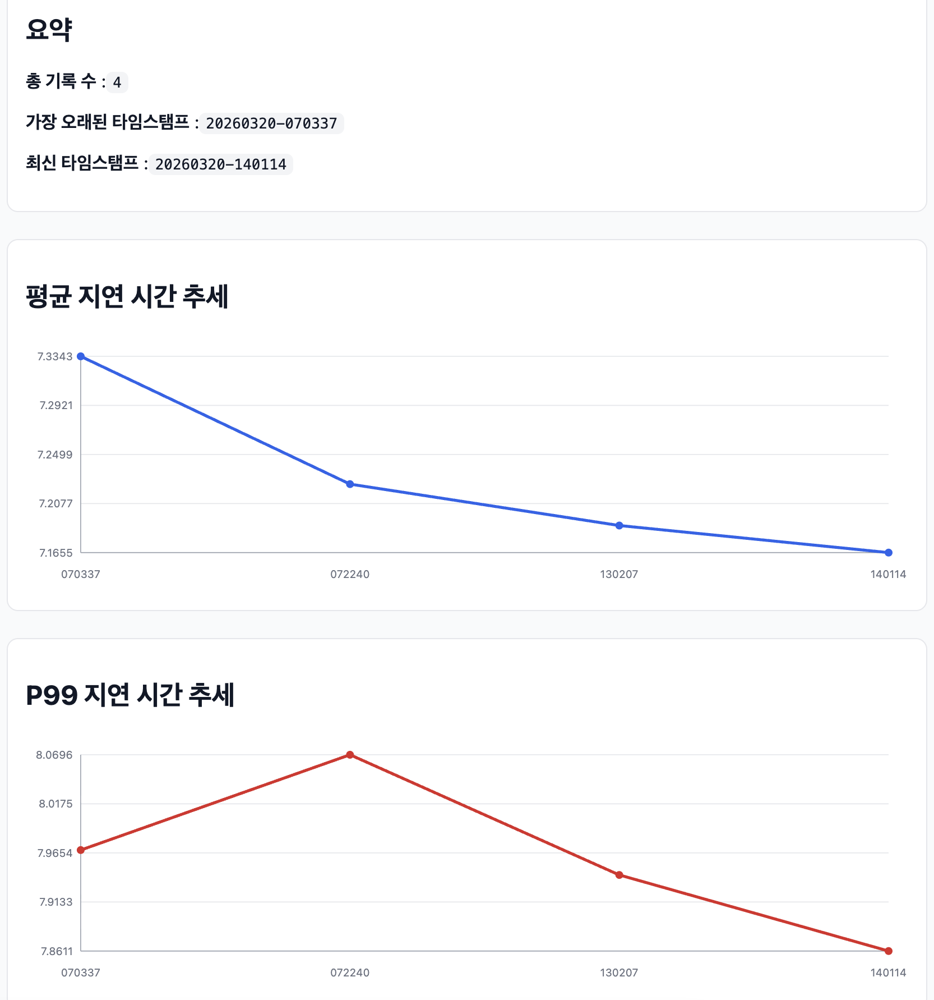
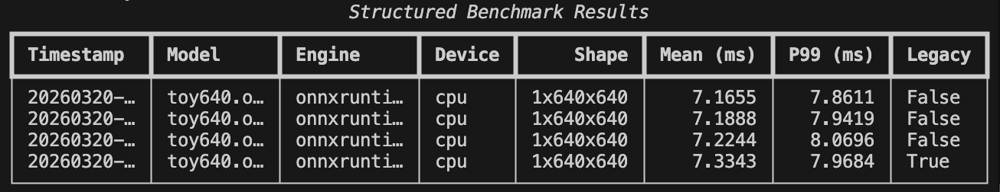
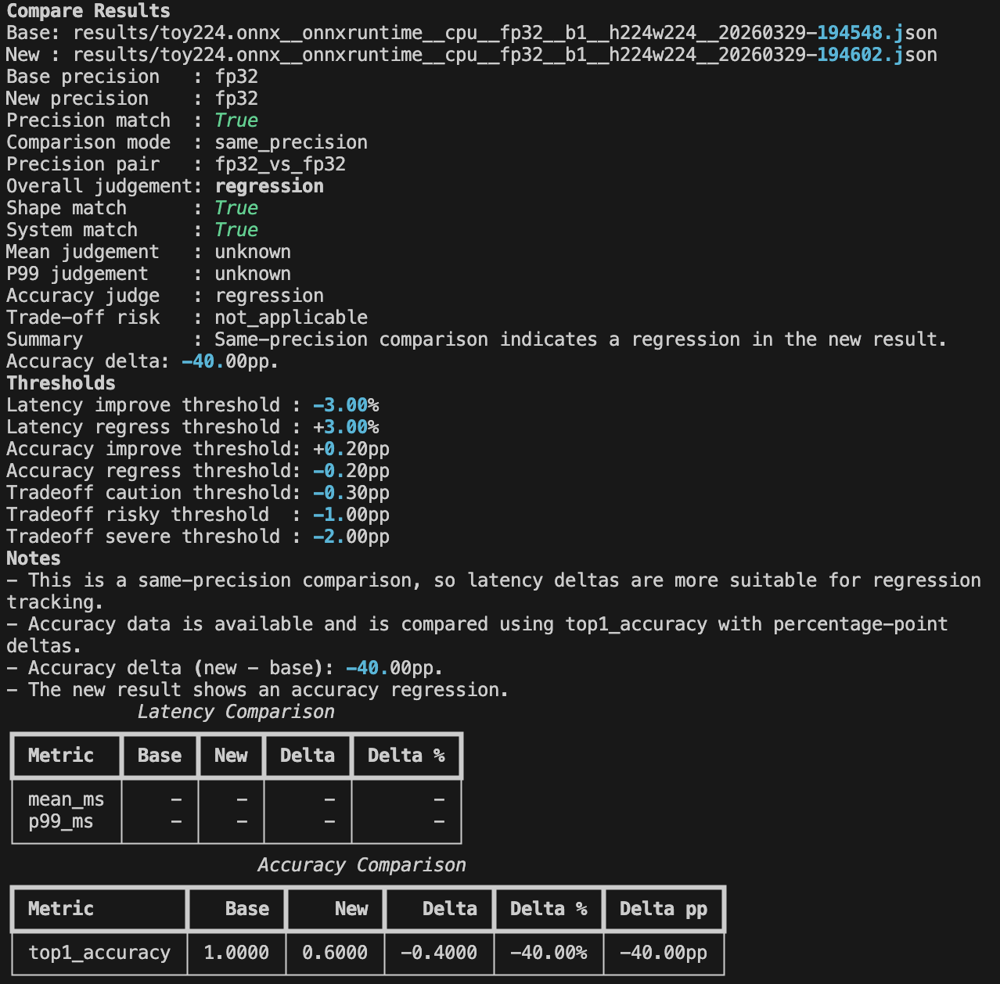
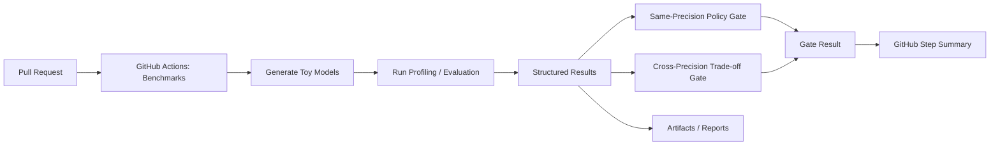
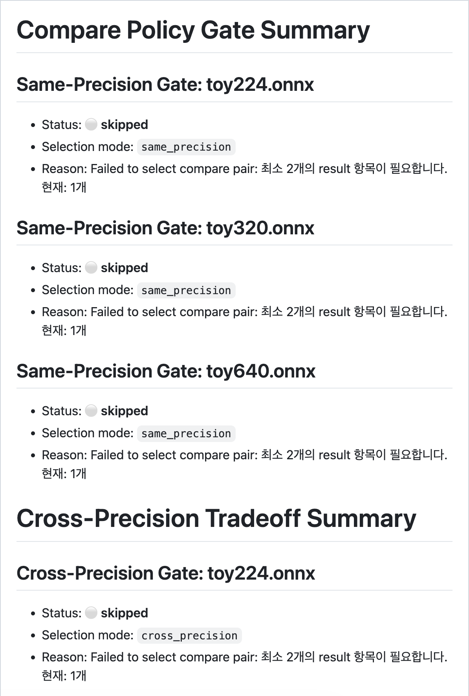

# EdgeBench

> Edge AI Inference Validation Framework  
> EdgeBench is a CLI-based framework for profiling, evaluating, comparing, and validating AI inference behavior across edge environments.

EdgeBench는 단순 benchmark 실행 도구가 아니라,  
**실제 Edge 디바이스에서 추론 결과를 저장·비교·해석·리포트화하는 inference validation workflow**를 목표로 설계된 CLI 기반 프로젝트입니다.

Jetson TensorRT와 Odroid RKNN 실측 결과를 같은 structured result schema와 compare/report 흐름으로 연결해,  
**“숫자를 한 번 찍는 도구”가 아니라 “배포 판단에 재사용할 수 있는 validation system”** 으로 확장한 점이 핵심입니다.

---

## Quick Facts

- Real HW validated on **Jetson TensorRT** and **Odroid RKNN**
- Reusable **structured result JSON** with runtime provenance
- **same-precision** regression/improvement/neutral judgement
- **cross-precision** trade-off interpretation and risk classification
- Markdown / HTML report generation from real device results
- CI-ready validation workflow for benchmark gating

---

## Why EdgeBench

- **단순 실행 결과를 넘어서기 위해**: 한 번 측정하고 끝나는 benchmark가 아니라, 저장·비교·해석 가능한 validation workflow를 지향
- **실제 배포 판단에 쓰기 위해**: latency만이 아니라 accuracy, precision 변화, runtime provenance까지 함께 관리
- **반복 검증 가능하게 만들기 위해**: same-precision regression tracking과 cross-precision trade-off 해석을 구조화
- **문서와 CI에 재사용하기 위해**: 결과를 Markdown / HTML report와 PR 단계 validation gate로 연결

---

## Validation Snapshot

- Jetson Orin Nano 환경에서 TensorRT GPU inference validation 완료
- `resnet18`, `yolov8n`에 대해 repeated profiling → structured result 저장 → `compare-latest` → Markdown / HTML report 생성까지 검증 완료
- structured result JSON 원문에서 `extra.runtime_artifact_path`, `primary_input_name`, `resolved_input_shapes`, `effective_*` 필드 저장 확인
- Odroid M1 / M2 환경에서 RKNN NPU curated detection result 흡수 완료
- Odroid M2 환경에서 `yolov8n.onnx` + `yolov8n_fp16.rknn` 조합으로 RKNN NPU profiling 실기 검증 완료
- RKNN structured result JSON에 `engine=rknn`, `device=npu`, `runtime_artifact_path`, `primary_input_name`, `resolved_input_shapes` 저장 확인
- RKNN same-precision `compare-latest` 및 `history-report` 재사용 검증 완료
- FP16 ↔ INT8 cross-precision compare 및 trade-off risk 판정 지원
- detection-aware accuracy compare/report 지원


---

## What is already proven?

- Jetson TensorRT execution path works on real hardware
- TensorRT profile results are saved as reusable structured results
- runtime provenance is preserved in result JSON
- same-precision compare judgement works on Jetson validation outputs
- Markdown / HTML validation reports are generated from real device results
- RKNN curated validation results are reusable in the same compare/report workflow
- RKNN runtime profiling works on Odroid M2 real hardware
- RKNN runtime results are saved as reusable structured results
- RKNN same-precision and cross-precision compare flows both execute on real device outputs

---

## Jump to Evidence

- [Benchmark reference table](BENCHMARKS.md)
- [Jetson TensorRT validation runbook](docs/validation/jetson_tensorrt_validation.md)
- [Portfolio design & architecture document](docs/portfolio/edgebench_portfolio.md)
- [Project roadmap](Roadmap.md)

---

## ⚡ Validation Evidence (Real Edge HW)

EdgeBench는 toy CPU benchmark 예제에 머무르지 않고,  
**Jetson GPU**와 **Odroid NPU**에서 확보한 실제 추론 결과를 같은 validation workflow 안에서 재사용합니다.

특히 Jetson TensorRT 경로에서는 단순 실행 성공만이 아니라,  
profiling 결과의 structured result 저장, `compare-latest` 재사용, Markdown / HTML report 생성, runtime provenance 기록까지 함께 검증했습니다.

### Jetson TensorRT (GPU)

- `resnet18`, `yolov8n` TensorRT profiling 실기 검증 완료
- `engine=tensorrt`, `device=gpu`, `precision=fp16` metadata 저장 확인
- structured result JSON 원문에 `runtime_artifact_path`, `primary_input_name`, `resolved_input_shapes`, `effective_batch`, `effective_height`, `effective_width` 저장 확인
- TensorRT execution → structured result → `compare-latest` → Markdown / HTML report pipeline 연결 확인

**Example 1 (Jetson TensorRT, resnet18, same-precision)**

| Run | Mean Latency | P99 Latency | Interpretation |
|---|---:|---:|---|
| Base | 2.9544 ms | 3.4980 ms | 기준 측정 |
| New | 2.8265 ms | 2.8929 ms | same-precision improvement 감지 |

**Example 2 (Jetson TensorRT, yolov8n, same-precision)**

| Run | Mean Latency | P99 Latency | Interpretation |
|---|---:|---:|---|
| Base | 14.2246 ms | 14.7342 ms | 기준 측정 |
| New | 14.0697 ms | 14.7342 ms | same-precision neutral 판정 |

이 결과는 TensorRT 경로가 단순 실행 가능 여부만이 아니라,
동일 precision 조건에서의 regression / improvement / neutral tracking에 재사용될 수 있음을 보여줍니다.
또한 runtime provenance가 compare 출력뿐 아니라 structured result JSON 원문에도 저장되어,
실행에 사용한 engine artifact와 실제 입력 shape 해석 결과를 함께 추적할 수 있습니다.

### Odroid RKNN (NPU)

- Odroid M1 / M2 기반 YOLOv8n / YOLOv8s detection benchmark 결과 정리
- FP16 ↔ INT8(hybrid quantization) cross-precision validation 지원
- detection task 기준 `map50` primary metric / `f1_score` 등 보조 metric 해석 지원
- Odroid M2 실기 환경에서 RKNN runtime backend 기반 `profile` 실행 검증 완료
- RKNN structured result JSON에 `engine=rknn`, `device=npu`, `runtime_artifact_path`, `primary_input_name`, `resolved_input_shapes` 저장 확인
- RKNN same-precision `compare-latest` 및 `history-report` 재사용 검증 완료
- RKNN runtime cross-precision `compare-latest` 실행 검증 완료

**Example 1 (YOLOv8n, Odroid M2, cross-precision curated validation)**

| Precision | Mean Latency | Accuracy (mAP50) | Interpretation |
|---|---:|---:|---|
| FP16 | 51.82 ms | 0.7791 | 기준 결과 |
| Hybrid INT8 | 16.29 ms | 0.7977 | 더 빠르면서 accuracy도 유지/개선 |

이 예시는 cross-precision compare가 latency 이득과 accuracy 변화를 함께 해석해야 함을 보여줍니다.

**Example 2 (YOLOv8n, Odroid M2, RKNN runtime same-precision validation)**

| Run | Mean Latency | P99 Latency | Interpretation |
|---|---:|---:|---|
| Base | 72.4249 ms | 73.6221 ms | 기준 측정 |
| New | 71.8846 ms | 73.7026 ms | same-precision neutral 판정 |

이 결과는 Odroid M2 실기 환경에서 RKNN runtime profiling 결과가 structured result로 저장되고, 같은 fp16 조건에서 `compare-latest`와 `history-report` 흐름에 재사용될 수 있음을 보여줍니다. 또한 structured result JSON 원문에 `runtime_artifact_path`, `primary_input_name`, `resolved_input_shapes`가 함께 기록되어 실행 provenance 추적이 가능합니다.

**Example 3 (YOLOv8n, Odroid M2, RKNN runtime cross-precision validation)**

| Precision | Mean Latency | P99 Latency | Interpretation |
|---|---:|---:|---|
| FP16 | 71.8846 ms | 73.7026 ms | 기준 결과 |
| INT8 | 35.0657 ms | 35.6140 ms | `tradeoff_faster` 판정, accuracy 없음으로 `unknown_risk` |

이 결과는 Odroid M2 실기 환경에서 RKNN runtime backend가 fp16 / int8 양쪽 모두에서 동작하며, cross-precision compare를 통해 latency trade-off를 실제 하드웨어 기준으로 해석할 수 있음을 보여줍니다. 다만 현재 이 pair에는 accuracy 결과가 포함되지 않아 trade-off risk는 `unknown_risk`로 판정됩니다.

👉 자세한 curated hardware validation 표와 runtime validation reference는 `BENCHMARKS.md`에서 확인할 수 있습니다.

---

## 📄 Portfolio Document

프로젝트 설계 배경, 아키텍처, validation workflow, 실제 Edge HW 검증 의미를 더 자세히 보려면 아래 문서를 참고하세요.

👉 [EdgeBench Portfolio (Detailed Design & Architecture)](docs/portfolio/edgebench_portfolio.md)

---

## 📌 프로젝트 개요

EdgeBench는 엣지 환경에서 AI 모델을 배포하기 전에 모델의 구조적 특성, 실제 추론 latency, accuracy 변화, precision trade-off를 함께 분석하고, 그 결과를 **저장·비교·추적·리포트화·CI 검증**할 수 있는 CLI 기반 시스템입니다.

정확도만으로는 모델의 배포 가능성을 판단할 수 없습니다. 실제 배포 관점에서는 latency, shape consistency, execution environment, precision(fp32 / int8 등), 그리고 precision 변경 시 accuracy 손실 허용 여부까지 함께 봐야 합니다.

EdgeBench는 다음을 제공합니다.

- 모델 파라미터 수 계산
- 모델 파일 크기 확인
- FLOPs 추정
- 실제 추론 latency 측정
- structured JSON 형태의 benchmark result 저장
- precision-aware 비교 및 리포트 생성

즉, EdgeBench는 단순 1회성 benchmark 스크립트가 아니라 **지속적인 성능 추적과 비교 해석을 지원하는 inference validation workflow**를 지향합니다.

---

## ⚡ 핵심 기능

- 📊 Static Analysis
  - Parameters, FLOPs, Model size 분석
- ⚡ Runtime Profiling
  - ONNX Runtime 기반 CPU profiling
  - TensorRT 기반 Jetson GPU profiling
  - RKNN 기반 Odroid NPU validation 지원 (curated result import + runtime profiling first validated path)
- 🎯 Accuracy Evaluation
  - classification manifest 기반 top-1 accuracy 평가
  - accuracy 결과를 structured result에 함께 저장
- 🧱 Structured Result System
  - 모든 결과를 JSON 스키마로 저장
  - 이후 비교 / 히스토리 추적 / 정책 판정에 재사용 가능
- 🔍 Accuracy-Aware Comparison
  - latency delta / accuracy delta / delta pp 비교
  - same-precision / cross-precision 해석 분리
- 📄 Report Generation
  - Markdown / HTML 리포트 생성
- 🤖 CI Validation Pipeline
  - same-precision regression 감지
  - cross-precision trade-off 감시

> 참고: 현재 EdgeBench는 ONNX Runtime CPU와 TensorRT Jetson 경로는 직접 실행(profiling)하고,
> RKNN은 실제 Odroid 실측 결과를 structured result로 흡수해 compare/report workflow에서 재사용하는 방식으로 지원합니다.

---

## 🎯 왜 필요한가?

Jetson, RK3588, CPU-only 환경과 같은 엣지 디바이스에서는 정확도만이 아니라 다음 요소가 중요합니다.

- 실시간 처리 가능 여부
- 연산량
- 메모리 요구량
- 실제 추론 지연 시간

EdgeBench는 이러한 정보를 하나의 CLI 인터페이스에서 통합 제공합니다.

---

## 🧠 아키텍처

CLI 기반 구조:

- Analyzer: 정적 모델 분석
- Profiler: 동적 추론 성능 측정
- Engine Interface: 추론 엔진 추상화 계층

현재 지원:

- ONNX Runtime CPU
- TensorRT Jetson GPU first working path
- RKNN curated result import for Odroid NPU validation
- Classification accuracy evaluation
- Detection-aware compare/report (`map50` primary, `f1_score` 등 추가 metric 유지)
- CI compare policy gate

### TensorRT Backend Status

- `tensorrt` backend name은 CLI와 engine registry에 등록되어 있습니다.
- 현재 TensorRT backend는 Jetson 실기에서 동작하는 first working path까지 구현 및 검증된 상태입니다.

현재 가능한 것:

- TensorRT engine deserialize
- IO metadata extraction
- CUDA device buffer allocation
- dummy input generation
- TensorRT execution
- CLI `profile` 연동
- structured result 저장 및 compare/report 재사용

실행 전제 조건:

- Jetson 환경
- TensorRT Python bindings
- `cuda-python` low-level driver bindings
- ONNX source path와 대응되는 compiled `.engine` artifact

검증 완료 범위:

- `resnet18` TensorRT profiling
- `yolov8n` TensorRT profiling
- `engine=tensorrt`, `device=gpu`, `precision=fp16` metadata 저장
- TensorRT GPU result의 `compare-latest` / report 재사용
- structured result JSON 내 `runtime_artifact_path` / `primary_input_name` / `resolved_input_shapes` / `effective_*` 필드 저장 확인

현재 상태:

- Jetson 실기에서 동작하는 first working path까지 검증되었습니다.
- 상세 제약 및 환경 조건은 아래의 `Current Limitations & Environment Notes` 섹션을 참고하세요.

`model_path` vs `engine_path`:

- `model_path`: static analysis, reporting, result provenance에 사용하는 원본 ONNX source path
- `engine_path`: Jetson에서 runtime execution에 사용하는 compiled TensorRT engine artifact path

현재 Jetson execution path:

- `model_path` 기준으로 ONNX analysis와 report provenance를 유지합니다.
- `engine_path` 에서 compiled TensorRT engine을 load / deserialize 합니다.
- execution context, IO metadata, CUDA buffer, CUDA stream을 준비합니다.
- TensorRT inference를 수행하고 결과를 structured result로 저장합니다.

### RKNN / Odroid Validation Status

EdgeBench는 ONNX / TensorRT 뿐 아니라  
RKNN 기반 NPU 환경의 실측 결과도 validation workflow에 연결할 수 있도록 확장되었습니다.

검증 환경:

- Odroid M1 (RK3568 NPU)
- Odroid M2 (RK3588 NPU)
- RKNN Toolkit 기반으로 생성·측정된 실측 결과 사용

지원 범위:

- RKNN benchmark 결과 → EdgeBench result schema로 import
- imported RKNN result에 대한 cross-precision compare (fp16 vs int8)
- detection task 기반 accuracy-aware trade-off 분석
- latency vs accuracy trade-off risk classification
- Odroid M2 실기 환경에서 RKNN runtime backend 기반 직접 profiling
- RKNN runtime structured result 저장
- RKNN runtime same-precision compare / history-report 재사용
- RKNN runtime cross-precision compare 실행 검증

compare-latest 예시:

```bash
poetry run edgebench compare-latest \
  --model yolov8n \
  --engine rknn \
  --device odroid_m2 \
  --selection-mode cross_precision
```

대표 curated 결과 예시:
	•	YOLOv8n (Odroid M2)
	•	FP16 → Hybrid INT8
	•	latency: 51.82ms → 16.29ms
	•	map50: 0.7791 → 0.7977

대표 runtime 결과 예시:
	•	YOLOv8n (Odroid M2, RKNN runtime same-precision)
	•	fp16 → fp16
	•	mean latency: 72.4249ms → 71.8846ms
	•	p99 latency: 73.6221ms → 73.7026ms
	•	overall: neutral
	•	YOLOv8n (Odroid M2, RKNN runtime cross-precision)
	•	fp16 → int8
	•	mean latency: 71.8846ms → 35.0657ms
	•	p99 latency: 73.7026ms → 35.6140ms
	•	overall: tradeoff_faster
	•	trade-off risk: unknown_risk

최신 검증 기준으로는 curated import 결과뿐 아니라,
Odroid M2 실기 환경에서 yolov8n.onnx + RKNN runtime artifact 조합의 직접 profiling도 성공했습니다.

실제 검증에서는:
	•	engine=rknn, device=npu, precision=fp16/int8 metadata 저장
	•	runtime_artifact_path, primary_input_name, resolved_input_shapes 저장
	•	same-precision compare-latest 성공
	•	cross-precision compare-latest 성공
	•	history-report HTML 생성

까지 확인했습니다.

다만 현재 runtime cross-precision pair는 accuracy 결과를 함께 저장하지 않았기 때문에, trade-off risk는 unknown_risk로 해석됩니다.

👉 상세 실험 표와 curated validation 데이터, runtime validation reference는 BENCHMARKS.md 참고.

### Jetson TensorRT Validation Flow

Jetson에서 TensorRT 경로를 검증할 때는 아래 흐름이면 충분합니다.

1. `scripts/check_jetson_tensorrt_env.py` 로 Jetson / TensorRT / `cuda-python` 준비 상태를 확인합니다.
2. ONNX source model과 대응되는 compiled `.engine` artifact를 준비합니다.
3. `edgebench profile --engine tensorrt --engine-path ... --precision fp16` 로 실제 TensorRT profiling을 실행합니다.
4. 결과 JSON에 `engine=tensorrt`, `device=gpu`, `precision=fp16` metadata가 저장되는지 확인합니다.
5. `compare-latest` 와 report 흐름에서 TensorRT GPU result가 재사용되는지 확인합니다.

실제 검증에서는 `resnet18`과 `yolov8n`에 대해 Jetson TensorRT profiling을 반복 실행한 뒤,
`compare-latest`로 same-precision pair를 선택해 비교했고,
그 결과를 Markdown / HTML report로 저장하여 report 재사용 경로까지 함께 확인했습니다.

최신 실기 검증 기준으로,
- `resnet18`은 same-precision compare에서 **improvement**
- `yolov8n`은 same-precision compare에서 **neutral**
로 판정되었습니다.

또한 structured result JSON 원문에서 `extra.runtime_artifact_path`가 실제 engine artifact 경로로 기록되는 것도 직접 확인했습니다.

### Jetson Validation Runbook

Jetson TensorRT 실기 검증 절차는 [docs/validation/jetson_tensorrt_validation.md](docs/validation/jetson_tensorrt_validation.md) 에 정리되어 있습니다.

문서에는 preflight check → repeated profiling → `compare-latest` → Markdown / HTML report 저장 순서의 재현 절차를 기록했습니다.
실제 검증 예시로는 `resnet18` same-precision improvement 사례와 `yolov8n` same-precision neutral 사례를 포함합니다.

### Validation Artifacts (Jetson)

Jetson 디바이스에서 실행한 validation 결과 예시는 아래 경로에 저장됩니다:

- reports/examples/jetson/

## 📌 포함되는 결과

- Markdown 형태의 비교 리포트
- HTML 기반 시각화 리포트
- Structured benchmark 결과(JSON 기반)

## ⚙️ 생성 방법

다음 스크립트를 통해 자동 생성됩니다:

scripts/run_jetson_tensorrt_validation.py

> 해당 결과는 실제 TensorRT 기반 추론 환경에서의 성능 및 정확도 변화를 검증하기 위한 자료입니다.

---

## ⚠️ Current Limitations & Environment Notes

### Python Version

EdgeBench는 현재 `Python >=3.10,<3.12` 범위를 기준으로 테스트하고 있습니다.

이 범위를 유지하는 이유는 다음과 같습니다.

- 현재 개발 및 검증 환경이 Python 3.10~3.11 기준으로 정리되어 있음
- `onnxruntime` 등 핵심 의존성의 실제 프로젝트 검증 범위를 먼저 안정화하는 것이 우선이기 때문
- 검증되지 않은 Python 3.12+ 환경을 성급하게 열기보다, 재현 가능한 실행 환경을 우선 유지하려는 목적

### TensorRT Backend

- TensorRT backend는 Jetson 환경에서만 직접 실행을 지원합니다.
- macOS 또는 일반 non-Jetson 환경에서는 TensorRT profiling을 실행할 수 없습니다.
- 현재 상태는 Jetson 실기에서 검증된 first working path이며, production-grade runtime polish는 아직 진행 중입니다.
- 다만 현재 기준으로는 first working path 검증이 완료된 상태이며, 장시간 반복 측정 자동화나 production-grade robustness polish는 후속 단계로 남아 있습니다.

추가 주의사항:

- TensorRT `.engine` plan 파일은 생성된 디바이스 / TensorRT 환경 의존성이 강합니다.
- 실제 Jetson 검증 중에도 TensorRT가 "different models of devices" 관련 경고를 출력할 수 있음을 확인했습니다.
- 따라서 가능하면 target Jetson 환경에서 생성한 `.engine` artifact를 사용하는 것이 바람직합니다.

### RKNN Support

- RKNN은 현재 두 가지 경로를 함께 지원합니다.
  - 문서화된 Odroid 실측 결과를 structured result로 import하여 compare/report에 연결하는 curated validation 경로
  - Odroid M2 실기 환경에서 RKNN runtime backend를 통해 직접 profiling을 수행하는 first validated runtime path
- 다만 RKNN runtime 경로는 아직 detection accuracy까지 자동으로 함께 연결하는 full validation path는 아니며, 현재 실기 검증은 latency / provenance / compare/report 재사용 중심으로 확인되었습니다.
- 현재 문서화된 RKNN accuracy-aware 예시는 Odroid M1 / M2 실측값을 curated import한 결과를 기준으로 유지합니다.
- RKNN runtime dependency는 Poetry lock에 포함하지 않으며, Odroid/RK3588 대상 환경에서 별도로 설치하는 것을 전제로 합니다.

### Evaluate Support

- 현재 `evaluate` 명령은 classification top-1 accuracy 평가만 지원합니다.
- 입력 형식은 `.npy`, dataset manifest는 `JSONL` 기준입니다.
- single-input / single-output classification 모델만 지원합니다.

---

## 🧱 Structured Result System

EdgeBench는 모든 benchmark 결과를 다음과 같은 구조로 저장합니다.

- model / engine / device / precision
- input shape (batch, height, width)
- latency (mean, p99)
- system info (OS, CPU, Python)
- run config (threads, warmup, runs)

이 구조를 기반으로 다음이 가능합니다.

- 결과 비교 (`compare`)
- 최신 comparable pair 자동 비교 (`compare-latest`)
- same-precision regression tracking
- cross-precision trade-off comparison
- Markdown / HTML report 생성
- CI 성능 추적
- runtime provenance (`extra.runtime_artifact_path`, `primary_input_name`, `resolved_input_shapes`, `effective_*`)

이 저장 구조 덕분에 EdgeBench는 단순 일회성 benchmark가 아니라 **지속적인 성능 추적, regression 감시, precision-aware 비교 해석이 가능한 도구**로 확장됩니다.

---

## 📊 Comparison & Report

EdgeBench는 benchmark 결과를 단순 출력에 그치지 않고 **비교와 리포트 생성까지 자동화**합니다.

지원 기능:

- `compare`
  - 두 structured result를 직접 비교
  - latency delta / accuracy delta / delta pp / shape / system / run config 비교
  - threshold 기반 judgement와 trade-off risk classification 제공
- `compare-latest`
  - 조건에 맞는 최신 comparable pair 자동 선택
  - `same_precision`: 같은 precision의 최신 2개 비교
  - `cross_precision`: precision이 다른 최신 compatible pair 비교
- `history-report`
  - 과거 benchmark 기록을 시간 순으로 정리
  - HTML trend chart 및 Markdown report 생성

출력 형태:

- CLI 표
- Markdown 리포트
- HTML 리포트

### Compare 해석 기준

- Same-precision compare
  - 회귀(regression) 추적에 적합
  - `overall`: improvement / neutral / regression
- Cross-precision compare
  - fp32 <-> int8 같은 precision trade-off 비교에 적합
  - `overall`: `tradeoff_faster` / `tradeoff_neutral` / `tradeoff_slower`
  - `tradeoff_risk`: `acceptable_tradeoff` / `caution_tradeoff` / `risky_tradeoff` / `severe_tradeoff`

### Example: Compare Latest



### Example: Compare Report

Accuracy-aware compare 결과는 Markdown / HTML 리포트로도 저장할 수 있습니다.



### Example: History Report



---

## 🖥 CLI 사용 예시

### 1. 모델 성능 측정

일반 profile 예시:

```bash
edgebench profile model.onnx \
  --warmup 10 \
  --runs 300 \
  --batch 1 \
  --height 320 \
  --width 320
```

TensorRT Jetson `resnet18` profile 예시:

```bash
poetry run edgebench profile models/resnet18.onnx \
  --engine tensorrt \
  --engine-path models/resnet18.engine \
  --precision fp16 \
  --warmup 10 \
  --runs 100 \
  --batch 1 \
  --height 224 \
  --width 224
```

TensorRT Jetson `yolov8n` profile 예시:

```bash
poetry run edgebench profile models/yolov8n.onnx \
  --engine tensorrt \
  --engine-path models/yolov8n.engine \
  --precision fp16 \
  --warmup 10 \
  --runs 50 \
  --batch 1 \
  --height 640 \
  --width 640
```

실기 검증은 현재 `python -m edgebench.cli` 경로 기준으로 확인되었습니다.

Jetson 환경 점검 스크립트 예시:

```bash
poetry run python scripts/check_jetson_tensorrt_env.py \
  --model-path model.onnx \
  --engine-path build/model.engine
```

- `models/resnet18.onnx`, `models/yolov8n.onnx` 는 analysis/reporting에 사용하는 ONNX source path입니다.
- `models/resnet18.engine`, `models/yolov8n.engine` 는 Jetson runtime execution에 사용하는 compiled TensorRT engine artifact입니다.
- 실행 결과는 Jetson 환경에서 실제 TensorRT inference를 수행한 뒤 structured result로 저장됩니다.

### 2. 저장된 결과 목록 확인

```bash
edgebench list-results
```

```bash
edgebench list-results --model toy640.onnx
```

```bash
edgebench list-results --legacy-only
```

### 3. 두 결과 직접 비교

```bash
edgebench compare result_a.json result_b.json
```

```bash
edgebench compare result_a.json result_b.json \
  --html-out compare.html \
  --markdown-out compare.md
```

### 4. 같은 조건의 최근 결과 자동 비교

compare-latest 일반 예시:

```bash
edgebench compare-latest
```

```bash
edgebench compare-latest --model toy640.onnx
```

```bash
edgebench compare-latest \
  --model toy224.onnx \
  --engine onnxruntime \
  --device cpu \
  --precision fp32
```

```bash
edgebench compare-latest \
  --model toy224.onnx \
  --engine onnxruntime \
  --device cpu \
  --selection-mode cross_precision
```

compare-latest TensorRT `resnet18` 예시:

```bash
edgebench compare-latest \
  --model resnet18.onnx \
  --engine tensorrt \
  --device gpu \
  --precision fp16
```

compare-latest TensorRT `yolov8n` 예시:

```bash
edgebench compare-latest \
  --model yolov8n.onnx \
  --engine tensorrt \
  --device gpu \
  --precision fp16
```

```bash
edgebench compare-latest \
  --html-out latest.html \
  --markdown-out latest.md
```

- `same_precision` 모드는 같은 precision의 최신 2개를 비교합니다.
- `cross_precision` 모드는 model / engine / device / batch / height / width 조건이 같은 상태에서 precision이 다른 최신 pair를 자동 선택합니다.
- TensorRT GPU 결과도 동일한 selection policy를 따릅니다.

### 5. 히스토리 리포트 생성

```bash
edgebench history-report --model toy640.onnx --html-out history_toy640.html
```

```bash
edgebench history-report \
  --model toy640.onnx \
  --html-out history_toy640.html \
  --markdown-out history_toy640.md
```

### Example: Stored Result Listing



---

## 🚀 Quickstart (3-minute demo)

처음 실행해보는 경우에는 ONNX Runtime CPU 기준 toy 모델 demo부터 시작하는 것이 가장 안정적입니다.  
Jetson TensorRT와 RKNN/Odroid 결과는 그 이후 확장 검증 경로로 이해하면 됩니다.

아래 단계만 따라하면 EdgeBench의 핵심 기능을 바로 실행해볼 수 있습니다.

### 1. 설치

```bash
git clone https://github.com/gwonxhj/edgebench.git
cd edgebench

pip install poetry
poetry install
```

### 2. Toy 모델 생성

```bash
poetry run python scripts/make_toy_model.py \
  --height 224 \
  --width 224 \
  --out models/toy224.onnx
```

### 3. 모델 프로파일링

```bash
poetry run edgebench profile models/toy224.onnx \
  --warmup 10 \
  --runs 50 \
  --batch 1 \
  --height 224 \
  --width 224
```

결과:

- `results/*.json` 생성
- latency (mean / p99) 저장

### 4. 결과 비교

compare-latest 일반 예시:

```bash
poetry run edgebench compare-latest \
  --model toy224.onnx \
  --engine onnxruntime \
  --device cpu \
  --precision fp32
```

compare-latest TensorRT `resnet18` 예시:

```bash
poetry run edgebench compare-latest \
  --model resnet18.onnx \
  --engine tensorrt \
  --device gpu \
  --precision fp16
```

compare-latest TensorRT `yolov8n` 예시:

```bash
poetry run edgebench compare-latest \
  --model yolov8n.onnx \
  --engine tensorrt \
  --device gpu \
  --precision fp16
```

출력:

- latency 변화 (delta / %)
- overall judgement (improvement / regression / neutral)
- trade-off risk (cross-precision 시)
- compare-latest 선택 모드와 identity 기준, base/new candidate가 CLI에 함께 표시됩니다.

### 5. (선택) Cross-Precision 비교

```bash
poetry run edgebench compare-latest \
  --model toy224.onnx \
  --engine onnxruntime \
  --device cpu \
  --selection-mode cross_precision
```

이 과정을 통해 EdgeBench의 핵심 workflow인  
**profile -> structured result -> compare -> judgement**를 체험할 수 있습니다.

---

## 🎯 Accuracy Evaluation Demo

EdgeBench의 `evaluate` 명령은 현재 **classification top-1 accuracy** 평가를 지원합니다.

### Evaluate 입력 형식

현재 evaluator는 아래 조건을 기대합니다.

- 입력 파일 형식: `.npy`
- dataset manifest 형식: `JSONL`
- 입력 key 기본값: `input`
- 정답 label key 기본값: `label`
- single-input / single-output classification 모델만 지원

manifest 한 줄 예시는 아래와 같습니다.

```json
{"input": "tmp_eval/sample_000.npy", "label": 0}
```

### Demo 데이터 생성

아래 스크립트는 evaluate 데모용 `.npy` 입력과 `manifest.jsonl`을 자동 생성합니다.

```bash
mkdir -p tmp_eval

poetry run python scripts/make_eval_demo_data.py \
  --model models/toy224.onnx \
  --out-dir tmp_eval \
  --count 5 \
  --height 224 \
  --width 224
```

### Accuracy Compare Example

아래는 동일한 모델에 대해 label을 일부 변형한 dataset으로 evaluate를 수행한 후, accuracy-aware compare를 실행한 결과 예시입니다.

- Base accuracy: 1.0000
- New accuracy: 0.6000
- Accuracy delta: -40.00pp
- Overall judgement: regression



### Evaluate 실행 예시

evaluate 예시:

```bash
poetry run edgebench evaluate models/toy224.onnx \
  --dataset-manifest tmp_eval/manifest.jsonl \
  --task classification \
  --precision fp32 \
  --input-key input \
  --label-key label
```

### Evaluate 결과

evaluate 실행 시 아래 정보가 structured result로 저장됩니다.

- sample_count
- correct_count
- top1_accuracy
- evaluation_config
- model_input metadata

또한 `results/*.json` 안에 `run_config.mode = evaluate` 형태로 저장되므로, 이후 compare 또는 compare-latest를 통해 accuracy-aware 비교에 활용할 수 있습니다.

### Accuracy Compare Demo

아래 스크립트는 기존 manifest를 기반으로 일부 label을 의도적으로 변경한 variant manifest를 생성합니다.

```bash
poetry run python scripts/make_eval_variant_manifest.py \
  --src tmp_eval/manifest.jsonl \
  --out tmp_eval/manifest_variant.jsonl \
  --flip-count 2 \
  --num-classes 10 \
  --delta 1
```

그다음 variant manifest로 evaluate를 한 번 더 실행합니다.

```bash
poetry run edgebench evaluate models/toy224.onnx \
  --dataset-manifest tmp_eval/manifest_variant.jsonl \
  --task classification \
  --precision fp32 \
  --input-key input \
  --label-key label
```

accuracy compare demo 예시:

```bash
poetry run edgebench compare-latest \
  --model toy224.onnx \
  --engine onnxruntime \
  --device cpu \
  --precision fp32
```

이 흐름을 통해 EdgeBench가 단순 latency benchmark 도구가 아니라 **accuracy-aware inference validation workflow**로 동작함을 확인할 수 있습니다.

### Notes

- accuracy 결과는 latency와 별도로 저장되며, compare 단계에서 함께 해석됩니다.
- evaluator의 입력 형식 및 현재 지원 범위는 `Current Limitations & Environment Notes` 섹션을 참고하세요.

---

## 🗺 개발 로드맵

자세한 계획은 `Roadmap.md` 참고

---

## 🤖 CI Benchmark & Validation Gate

EdgeBench는 GitHub Actions 기반 CI에서 자동으로 다음을 수행합니다.

1. toy benchmark 모델 생성
2. profiling 수행
3. benchmark artifact 저장
4. same-precision compare policy gate 실행
5. cross-precision trade-off gate 실행
6. GitHub Actions step summary에 compare 결과 게시

이를 통해 다음이 가능합니다.

- PR마다 benchmark 자동 실행
- same-precision regression 자동 감지
- cross-precision severe trade-off 자동 감시
- multi-size(224 / 320 / 640) benchmark summary 자동 표시
- compare policy 결과를 PR UI에서 바로 확인

즉 EdgeBench의 CI는 단순 benchmark runner가 아니라 **performance regression + precision trade-off validation pipeline**으로 동작합니다.

---

## 🔄 CI Validation Flow

EdgeBench의 CI는 단순 benchmark 실행이 아니라, benchmark 결과를 기준으로 regression과 precision trade-off를 함께 검증합니다.



이 파이프라인을 통해 EdgeBench는 **same-precision tracking**과 **cross-precision trade-off validation**을 모두 자동화합니다.

### Example: GitHub Actions Step Summary



## 📈 Benchmarks

EdgeBench는 정적 지표(FLOPs, Parameters)와 동적 지표(Latency)를 하나의 리포트 스키마로 통합 제공합니다.

> 환경: GitHub Codespaces (Linux x86_64), ONNX Runtime CPU  
> 설정: warmup=10, intra_threads=1, inter_threads=1

---

### 🔄 Auto-Generated Benchmark Results

> 아래 표는 `make demo` 또는 CI 실행 시 자동 갱신됩니다.

<!-- EDGE_BENCH:START -->

| Model | Engine | Device | Batch | Input(HxW) | FLOPs | Mean (ms) | P99 (ms) | Timestamp (UTC) |
|---|---|---:|---:|---:|---:|---:|---:|---|
| toy224.onnx | onnxruntime | cpu | 1 | 224x224 | 126,444,160 | 0.450 | 0.488 | 2026-02-27T07:05:49Z |
| toy320.onnx | onnxruntime | cpu | 1 | 320x320 | 258,048,640 | 0.908 | 0.943 | 2026-02-27T07:05:50Z |
| toy640.onnx | onnxruntime | cpu | 1 | 640x640 | 1,032,192,640 | 4.250 | 5.423 | 2026-02-27T07:05:53Z |

<!-- EDGE_BENCH:END -->

> `BENCHMARKS.md`에는 CI/auto-generated benchmark 요약과 별도로,  
> 실제 Odroid RKNN 실측 결과를 정리한 curated hardware validation 표가 함께 정리됩니다.

---

## 📜 License

MIT License

---
