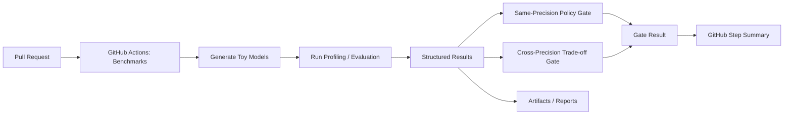

# EdgeBench

> Edge AI Inference Validation Framework
> EdgeBench is a CLI-based framework for profiling, evaluating, comparing, and validating AI inference behavior across edge environments.

EdgeBench는 단순 Benchmark 실행 도구가 아니라,
**latency 측정 + accuracy 비교 + precision trade-off 해석 + CI policy gate**까지 연결되는 **inference validation workflow**를 목표로 설계된 프로젝트입니다.

---

## 📄 Portfolio Document

👉 [EdgeBench Portfolio (Detailed Design & Architecture)](docs/portfolio/edgebench_portfolio.md)

---

## 📌 프로젝트 개요

EdgeBench는 엣지 환경에서 AI 모델을 배포하기 전에  
모델의 구조적 특성, 실제 추론 latency, accuracy 변화, precision trade-off를 함께 분석하고,
그 결과를 **저장·비교·추적·리포트화·CI 검증**할 수 있는 CLI 기반 시스템입니다.

정확도(Accuracy)만으로는 모델의 배포 가능성을 판단할 수 없습니다.
실제 배포 관점에서는 latency, shape consistency, execution environment, precision(fp32 / int8 등),
그리고 precision 변경 시 accuracy 손실 허용 여부까지 함께 봐야 합니다.

EdgeBench는 다음을 제공합니다:

- 모델 파라미터 수 계산
- 모델 파일 크기 확인
- FLOPs 추정
- CPU 기반 실제 추론 latency 측정
- structured JSON 형태의 benchmark result 저장
- precision-aware 비교 및 리포트 생성

즉, EdgeBench는 단순 1회성 benchmark 스크립트가 아니라
**지속적인 성능 추적과 비교 해석을 지원하는 inference validation workflow** 를 목표로 합니다.

---

## ⚡ 핵심 기능

EdgeBench는 단순한 벤치마크 도구가 아니라  
**모델 성능을 측정하고, 비교하고, 해석하고, CI에서 검증하는 시스템**입니다.

- 📊 Static Analysis  
  - Parameters, FLOPs, Model size 분석

- ⚡ Runtime Profiling  
  - ONNX Runtime 기반 실제 latency 측정 (mean / p99)

- 🎯 Accuracy Evaluation  
  - classification manifest 기반 top-1 accuracy 평가
  - accuracy 결과를 structured result에 함께 저장

- 🧱 Structured Result System  
  - 모든 결과를 JSON 스키마로 저장
  - 이후 비교 / 히스토리 추적 / 정책 판정에 재사용 가능

- 🔍 Accuracy-Aware Comparison  
  - 두 structured result를 직접 비교 (latency delta / % 변화 / accuracy delta / delta pp)
  - same-precision 비교에서는 regression / improvement / neutral 판단
  - cross-precision 비교에서는 trade-off semantics와 trade-off risk classification 제공
  - precision mismatch를 Markdown / HTML report에 명시적으로 표시

- 🎯 Precision-Aware Compare Workflow
  - fp32 / int8 등 precision 정보를 result schema에 저장
  - `compare-latest` 에서 same_precision / cross_precision selection mode 지원
  - cross-precision 비교 시 latest compatible pair를 자동 선택
  - same-condition regression과 precision trade-off를 분리해서 해석

- 🕓 History Tracking  
  - 같은 조건의 과거 benchmark 결과를 누적 조회
  - mean / p99 추세 확인 가능

- 📄 Report Generation  
  - Markdown / HTML 리포트 자동 생성
  - compare / history 결과를 문서로 저장 가능
  - compare threshold와 trade-off risk를 리포트에 반영

- 🤖 CI Validation Pipeline  
  - PR마다 자동 benchmark 실행
  - same-precision regression 자동 감지
  - cross-precision severe trade-off 자동 감시
  - GitHub Actions step summary로 gate 결과 가시화

- ⚙️ Threshold-Configurable Policy  
  - compare threshold를 pyproject 기반으로 관리 가능
  - CLI override를 통해 실험/정책 기준 조정 가능

---

## 🎯 왜 필요한가?

Jetson, RK3588, CPU-only 환경과 같은 엣지 디바이스에서는  
모델의 정확도보다 다음 요소가 더 중요합니다:

- 실시간 처리 가능 여부
- 연산량
- 메모리 요구량
- 실제 추론 지연 시간

EdgeBench는 이러한 정보를 하나의 CLI 인터페이스에서 통합 제공합니다.

---

## 🧠 아키텍처

CLI 기반 구조:

- Analyzer: 정적 모델 분석
- Profiler: 동적 추론 성능 측정
- Engine Interface: 추론 엔진 추상화 계층

현재 지원:
- ONNX Runtime CPU
- Classification accuracy evaluation
- CI compare policy gate (same-precision / cross-precision)

향후 확장 예정:
- TensorRT
- RKNN
- Jetson CUDA Backend
- C++ 추론 엔진

---

## 🧱 Structured Result System

EdgeBench는 모든 벤치마크 결과를 다음과 같은 구조로 저장합니다:

- model / engine / device / precision
- input shape (batch, height, width)
- latency (mean, p99)
- system info (OS, CPU, Python)
- run config (threads, warmup, runs)

이 구조를 기반으로:

- 결과 비교 (`compare`)
- 최신 comparable pair 자동 비교 (`compare-latest`)
- same-precision regression tracking
- cross-precision trade-off comparison
- 리포트 생성 (Markdown / HTML)
- CI 성능 추적

이 가능합니다.

이 저장 구조 덕분에 EdgeBench는 단순 일회성 벤치마크가 아니라
**지속적인 성능 추적, regression 감시, precision-aware 비교 해석이 가능한 도구**로 확장됩니다.

---

## 📊 Comparison & Report

EdgeBench는 benchmark 결과를 단순 출력에 그치지 않고  
**비교와 리포트 생성까지 자동화**합니다.

지원 기능:

- `compare`  
  - 두 structured result를 직접 비교
  - latency delta / delta % / accuracy delta / accuracy delta pp / shape / system / run config 비교
  - precision mismatch를 감지하고 compare context에 반영
  - threshold 기반 judgement와 trade-off risk classification 제공
  - cross-precision 비교에서는 same-condition regression이 아닌 trade-off semantics 사용

- `compare-latest`  
  - 조건에 맞는 최신 comparable pair를 자동 선택하여 비교
  - `same_precision` 모드: 같은 precision의 최신 2개 비교
  - `cross_precision` 모드: precision이 다른 최신 compatible pair 비교

- `history-report`  
  - 과거 benchmark 기록을 시간 순으로 정리
  - HTML trend chart 및 Markdown report 생성

출력 형태:

- CLI 표 (rich)
- Markdown 리포트
- HTML 리포트

### Compare 해석 기준

- Same-precision compare
  - 회귀(regression) 추적에 적합
  - `overall`: improvement / neutral / regression
  - accuracy가 함께 있을 경우 latency와 accuracy를 함께 반영하여 판정

- Cross-precision compare
  - fp32 <-> int8 같은 precision trade-off 비교에 적합
  - `overall` status: `tradeoff_faster` / `tradeoff_neutral` / `tradeoff_slower`
  - `tradeoff_risk`: `acceptable_tradeoff` / `caution_tradeoff` / `risky_tradeoff` / `severe_tradeoff`
  - precision 변경에 따른 latency 이득과 accuracy 손실을 함께 해석

- Threshold policy
  - latency / accuracy / trade-off threshold는 기본 정책값을 사용
  - 필요 시 CLI 옵션 또는 pyproject 설정으로 override 가능

### Example: Compare Latest


### Example: History Report


---

## 🛠 향후 확장 계획

- TensorRT backend
- RKNN (NPU) 지원
- Jetson GPU inference
- multi-device benchmark 비교
- visualization dashboard

---

## 🖥 CLI 사용 예시

### 1. 모델 성능 측정

```bash
edgebench profile model.onnx \
  --warmup 10 \
  --runs 300 \
  --batch 1 \
  --height 320 --width 320
```

---

### 2. 저장된 결과 목록 확인
```bash
edgebench list-results
edgebench list-results --model toy640.onnx
edgebench list-results --legacy-only
```

---

### 3. 두 결과 직접 비교
```bash
edgebench compare result_a.json result_b.json
edgebench compare result_a.json result_b.json --html-out compare.html --markdown-out compare.md
```

---

### 4. 같은 조건의 최근 결과 자동 비교
```bash
edgebench compare-latest
edgebench compare-latest --model toy640.onnx
edgebench compare-latest --model toy224.onnx --engine onnxruntime --device cpu --precision fp32
edgebench compare-latest --model toy224.onnx --engine onnxruntime --device cpu --selection-mode cross_precision
edgebench compare-latest --html-out latest.html --markdown-out latest.md
```

- `same_precision` 모드는 같은 precision의 최신 2개를 비교합니다.
- `cross_precision` 모드는 model / engine / device / shape 조건이 같은 상태에서 precision이 다른 최신 pair를 자동 선택합니다.
- cross-precision 비교 결과는 regression이 아닌 **trade-off semantics**로 해석됩니다.

---

### 5. 히스토리 리포트 생성
```bash
edgebench history-report --model toy640.onnx --html-out history_toy640.html
edgebench history-report --model toy640.onnx --html-out history_toy640.html --markdown-out history_toy640.md
```

### Example: Stored Result Listing


---

## 🚀 Quickstart (3-minute demo)

아래 단계만 따라하면 EdgeBench의 핵심 기능을 바로 실행해볼 수 있습니다.

### 1. 설치

```bash
git clone https://github.com/gwonxhj/edgebench.git
cd edgebench

pip install poetry
poetry install
```

---

### 2. Toy 모델 생성

```bash
poetry run python scripts/make_toy_model.py \
  --height 224 \
  --width 224 \
  --out models/toy224.onnx
```

---

### 3. 모델 프로파일링

```bash
poetry run edgebench profile models/toy224.onnx \
  --warmup 10 \
  --runs 50 \
  --batch 1 \
  --height 224 --width 224
```

결과:
- results/*.json 생성
- latency (mean / p99) 저장

---

### 4. 결과 비교

```bash
poetry run edgebench compare-latest \
  --model toy224.onnx \
  --engine onnxruntime \
  --device cpu \
  --precision fp32
```

출력:
- latency 변화 (delta / %)
- overall judgement (improvement / regression / neutral)
- trade-off risk (cross-precision 시)

---

### 5. (선택) Cross-Precision 비교

```bash
poetry run edgebench compare-latest \
  --model toy224.onnx \
  --engine onnxruntime \
  --device cpu \
  --selection-mode cross_precision
```

이 과정을 통해 EdgeBench의 핵심 workflow인
**profile -> structured result -> compare -> judgement**를 체험할 수 있습니다.

---

## 🎯 Accuracy Evaluation Demo

EdgeBench의 `evaluate` 명령은 현재 **classification top-1 accuracy** 평가를 지원합니다.

### Evaluate 입력 형식

현재 evaluator는 아래 조건을 기대합니다:

- 입력 파일 형식: `.npy`
- dataset manifest 형식: `JSONL`
- 입력 key 기본값: `input`
- 정답 label key 기본값: `label`
- single-input / single-output classification 모델만 지원

manifest 한 줄 예시는 아래와 같습니다.

```json
{"input": "tmp_eval/sample_000.npy", "label": 0}
```

---

### Demo 데이터 생성

아래 스크립트는 evaluate 데모용 `.npy` 입력과 `manifest.jsonl`을 자동 생성합니다.  
각 샘플의 label은 동일한 ONNX 모델의 예측 결과(argmax)로 기록되므로,
데모 환경에서는 evaluate 파이프라인이 안정적으로 동작하는지 바로 확인할 수 있습니다.

```bash
mkdir -p tmp_eval

poetry run python scripts/make_eval_demo_data.py \
  --model models/toy224.onnx \
  --out-dir tmp_eval \
  --count 5 \
  --height 224 \
  --width 224
```

---

### Evaluate 실행 예시

```bash
poetry run edgebench evaluate models/toy224.onnx \
  --dataset-manifest tmp_eval/manifest.jsonl \
  --task classification \
  --precision fp32 \
  --input-key input \
  --label-key label
```

---

### Evaluate 결과

evaluate 실행 시 아래 정보가 structured result로 저장됩니다.

- sample_count
- correct_count
- top1_accuracy
- evaluation_config
- model_input metadata

또한 results/*.json 안에 run_config.mode = evaluate 형태로 저장되므로,
이후 compare 또는 compare-latest를 통해 accuracy-aware 비교에 활용할 수 있습니다.

---

### Accuracy Compare Demo

아래 스크립트는 기존 manifest를 기반으로 일부 label을 의도적으로 변경한
variant manifest를 생성합니다.
이렇게 하면 동일한 입력 `.npy`를 사용하더라도 accuracy가 달라지는 evaluate result를 만들 수 있습니다.

```bash
poetry run python scripts/make_eval_variant_manifest.py \
  --src tmp_eval/manifest.jsonl \
  --out tmp_eval/manifest_variant.jsonl \
  --flip-count 2 \
  --num-classes 10 \
  --delta 1
```

그다음 variant manifest로 evaluate를 한 번 더 실행합니다.

```bash
poetry run edgebench evaluate models/toy224.onnx \
  --dataset-manifest tmp_eval/manifest_variant.jsonl \
  --task classification \
  --precision fp32 \
  --input-key input \
  --label-key label
```

이후 같은 조건의 최신 evaluate result 2개를 비교하면
accuracy delta / delta pp가 포함된 accuracy-aware compare 결과를 확인할 수 있습니다.

```bash
poetry run edgebench compare-latest \
  --model toy224.onnx \
  --engine onnxruntime \
  --device cpu \
  --precision fp32
```

이 흐름을 통해 EdgeBench가 단순 latency benchmark 도구가 아니라
**accuracy-aware inference validation workflow**로 동작함을 확인할 수 있습니다.

---

### Notes

- 현재 evaluator는 classification만 지원합니다.
- 현재 evaluator는 .npy 입력과 JSONL manifest를 기대합니다.
- 현재 evaluator는 single-input / single-output 모델만 지원합니다.
- accuracy 결과는 latency와 별도로 저장되며, compare 단계에서 함께 해석됩니다.

---

## 🗺 개발 로드맵

자세한 계획은 Roadmap.md 참고

---

## 🤖 CI Benchmark & Validation Gate

EdgeBench는 GitHub Actions 기반 CI에서 자동으로:

1. toy benchmark 모델 생성
2. profiling 수행
3. benchmark artifact 저장
4. same-precision compare policy gate 실행
5. cross-precision trade-off gate 실행
6. GitHub Actions step summary에 compare 결과 게시

이를 통해 다음이 가능합니다:

- PR마다 benchmark 자동 실행
- same-precision regression 자동 감지
- cross-precision severe trade-off 자동 감시
- multi-size(224 / 320 / 640) benchmark summary 자동 표시
- compare policy 결과를 PR UI에서 바로 확인

즉 EdgeBench의 CI는 단순 benchmark runner가 아니라,
**performance regression + precision trade-off validation pipeline** 으로 동작합니다.

---

## 🔄 CI Validation Flow

EdgeBench의 CI는 단순 benchmark 실행이 아니라,  
benchmark 결과를 기준으로 regression과 precision trade-off를 함께 검증합니다.



이 파이프라인을 통해 EdgeBench는
**same-precision tracking**과 **cross-precision trade-off validation**을 모두 자동화합니다.

### Example: GitHub Actions Step Summary


## 📈 Benchmarks

EdgeBench는 정적 지표(FLOPs, Parameters)와 동적 지표(Latency)를 하나의 리포트 스키마로 통합 제공합니다.

> 환경: GitHub Codespaces (Linux x86_64), ONNX Runtime CPU  
> 설정: warmup=10, intra_threads=1, inter_threads=1

---

### 🔄 Auto-Generated Benchmark Results
> 아래 표는 'make demo' 또는 CI 실행 시 자동 갱신됩니다.

<!-- EDGE_BENCH:START -->

| Model | Engine | Device | Batch | Input(HxW) | FLOPs | Mean (ms) | P99 (ms) | Timestamp (UTC) |
|---|---|---:|---:|---:|---:|---:|---:|---|
| toy224.onnx | onnxruntime | cpu | 1 | 224x224 | 126,444,160 | 0.450 | 0.488 | 2026-02-27T07:05:49Z |
| toy320.onnx | onnxruntime | cpu | 1 | 320x320 | 258,048,640 | 0.908 | 0.943 | 2026-02-27T07:05:50Z |
| toy640.onnx | onnxruntime | cpu | 1 | 640x640 | 1,032,192,640 | 4.250 | 5.423 | 2026-02-27T07:05:53Z |

<!-- EDGE_BENCH:END -->

> 전체 히스토리(raw)는 BENCHMARKS.md 참고

---

## 📜 License

MIT License

---


