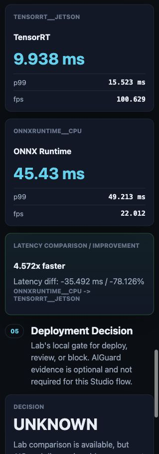
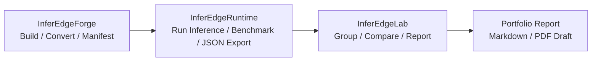

# InferEdgeLab

End-to-end Edge AI inference validation pipeline  
(C++ runtime · Jetson execution · validation · deployment decision)

Language: English | [한국어](README.ko.md)

**GitHub description:** Analysis/API layer for end-to-end Edge AI inference validation, reports, jobs, and deployment decisions.

## Summary

- End-to-end validation pipeline: Forge -> Runtime -> Lab -> optional AIGuard
- Real device execution: Jetson TensorRT + ONNX Runtime CPU
- Structured comparison: latency, accuracy, and validation evidence
- Deployment decision: deployable / review / blocked
- Comparability layer: InferEdgeEnv v0.1.5 records local benchmark evidence and comparability separately from Lab decisions
- Runtime Intelligence smoke chain: Orchestrator operation context -> EdgeEnv telemetry history/regression -> AIGuard deterministic evidence -> Lab-owned deployment risk report
- Local Studio: interactive workflow UI for inference validation

## What Makes InferEdge Different?

InferEdge is not a benchmark tool.

It is a validation pipeline that:

- runs real inference on edge devices
- evaluates accuracy and output validity
- detects anomalies and contract violations
- produces deployment-ready decisions

---

## InferEdge Pipeline Overview

InferEdge is organized as one product-style Edge AI inference validation pipeline:

```text
ONNX model
-> InferEdgeForge build
-> metadata / manifest / worker runtime summary
-> InferEdgeRuntime validation / result export
-> InferEdgeLab compare / API / job workflow / deployment_decision
-> optional InferEdgeAIGuard provenance diagnosis
-> deploy / review / blocked decision

Experiment hygiene / comparability layer:
InferEdgeEnv -> v0.1.5 v1-complete local-first run evidence registry / comparability checker

Runtime Intelligence smoke evidence chain:
InferEdgeOrchestrator operation feed
-> InferEdgeEnv telemetry history / comparability-first regression context
-> optional InferEdgeAIGuard deterministic runtime anomaly evidence
-> InferEdgeLab Runtime Intelligence Risk Summary / deployment risk report
```

Repository roles are deliberately split:

- **InferEdgeForge:** build artifact and provenance generation.
- **InferEdgeRuntime:** C++ execution, profiling, result export, and worker response boundary.
- **InferEdgeLab:** compare/report/API/job workflow and final deployment decision ownership.
- **InferEdgeAIGuard:** optional rule + evidence based failure and provenance diagnosis.
- **InferEdgeEnv:** v0.1.5 v1-complete experiment hygiene / comparability layer; local-first run evidence registry and comparability checker for Edge AI inference benchmark results.
- **InferEdgeOrchestrator:** supplemental operation context provider for queue, deadline, fallback, thermal, and resource evidence. It is not a comparability owner or deployment decision owner.

Portfolio boundary: InferEdgeLab is the validation / decision layer. InferEdgeEnv is the v0.1.5 v1-complete experiment hygiene / comparability layer. InferEdge validates whether a model is deployable; InferEdgeEnv records whether benchmark evidence can be trusted and compared.

Runtime Intelligence boundary: the current smoke chain preserves Orchestrator `edgeenv_runtime_telemetry_feed` as supplemental operation context, EdgeEnv `runtime_telemetry_context.history.telemetry_coverage` and `runtime_telemetry_history_seed` as producer-owned replay evidence, AIGuard `guard_analysis` as deterministic diagnosis evidence, and Lab as the final report/deployment decision owner. This is local-first runtime evidence automation, not production observability or a runtime control plane.

Implemented today: Lab API response contract, `/api/compare`, `/api/analyze` in-memory jobs, worker request/response mappings, Runtime dry-run validation/export, Forge worker/runtime summary, AIGuard provenance mismatch diagnosis, Lab decision/report evidence smoke coverage, dev-only Lab -> Runtime ONNX Runtime smoke using `yolov8n.onnx`, manual Jetson TensorRT Runtime smoke using a Forge manifest plus TensorRT engine artifact, Runtime source-model identity preservation for compare-ready TensorRT engine results, and the Runtime Intelligence smoke chain from Orchestrator operation feed through EdgeEnv/AIGuard into a Lab-owned risk summary.

Runtime identity polish: when a Forge manifest is applied, Runtime now preserves the manifest `source_model.path` identity for comparison naming. A TensorRT artifact such as `model.engine` can therefore keep `compare_model_name=yolov8n` and `compare_key=yolov8n__b1__h640w640__fp32` instead of degrading to `model__...`. This is provenance/compare-readiness polish, not production SaaS infrastructure.

Not implemented yet: real worker daemon, full automated Forge/Runtime execution from production Lab workers, DB/Redis/queue, file upload, production frontend beyond Local Studio, and production auth/billing/deployment controls.

Portfolio entry points: [portfolio submission](docs/portfolio/inferedge_portfolio_submission.md) · [resume/interview summary](docs/portfolio/inferedge_resume_interview_summary.md) · [1-page architecture summary](docs/portfolio/inferedge_1page_architecture.md) · [pipeline status](docs/portfolio/inferedge_pipeline_status.md)

Interview one-liner: **InferEdge is an end-to-end inference validation pipeline that converts, runs, compares, diagnoses, and decides whether an edge AI model candidate is ready to deploy.**

---

## Current Validation Evidence

YOLOv8n is validated through the current Local Studio evidence fixtures and Jetson Evidence Track result JSONs.
InferEdgeRuntime generates compare-ready JSON results, and InferEdgeLab groups and compares them by `compare_key`, `backend_key`, precision, and run context.

| Evidence | Backend | Precision | Power Mode | Mean ms | P95 ms | P99 ms | FPS |
|---|---|---|---|---:|---:|---:|---:|
| Local Studio baseline | ONNX Runtime CPU | FP32 | n/a | 45.4299 | n/a | 49.2128 | 22.0119 |
| Local Studio candidate | TensorRT Jetson | FP16 | 25W | 10.066401 | 15.476641 | 15.548438 | 99.340373 |
| Jetson power-mode evidence | TensorRT Jetson | FP16 | 15W | 10.799106 | 15.438690 | 15.529218 | 92.600262 |

The current Local Studio demo shows TensorRT Jetson FP16 25W as about 4.51x faster than the ONNX Runtime CPU FP32 baseline.
The Jetson 15W/25W comparison is tracked as system evidence because power mode changes the run configuration.
These measurements use InferEdgeRuntime end-to-end Runtime latency, not `trtexec` GPU-only latency.
The full pipeline portfolio summary is available at [docs/portfolio/inferedge_pipeline_portfolio.md](docs/portfolio/inferedge_pipeline_portfolio.md), and the detailed Runtime comparison report is available at [docs/portfolio/runtime_compare_yolov8n.md](docs/portfolio/runtime_compare_yolov8n.md).
The final local-first validation completion pass is summarized in [docs/portfolio/final_validation_completion.md](docs/portfolio/final_validation_completion.md).
The YOLOv8 COCO subset accuracy demo is documented in [docs/portfolio/yolov8_coco_subset_evaluation.md](docs/portfolio/yolov8_coco_subset_evaluation.md).
Validation problem cases are documented in [docs/portfolio/validation_problem_cases.md](docs/portfolio/validation_problem_cases.md).

## Local Studio (Recommended Demo Entry Point)

InferEdge Local Studio is a local-first browser interface for inspecting the existing CLI workflow, API/job contracts, Runtime evidence, Compare View, Jetson command helper, and Lab-owned deployment decision structure.
It runs on the user's machine through the FastAPI server and is intended as a local workflow UI foundation, not a production SaaS dashboard or cloud dashboard.

InferEdge Local Studio can replay the bundled portfolio evidence without requiring a live Jetson device during an interview walkthrough.
The `Load Demo Evidence` flow imports the ONNX Runtime CPU and TensorRT Jetson Runtime JSON fixtures from [examples/studio_demo](examples/studio_demo), refreshes Compare View, and keeps the demo pair selectable in Recent jobs while the local server process is running.

Recommended demo flow:

1. Run `poetry run inferedgelab serve --host 127.0.0.1 --port 8000`
2. Open `http://localhost:8000/studio`
3. Click `Load Demo Evidence`
4. Review TensorRT vs ONNX Runtime comparison and deployment decision context

The same evidence can be exported from the CLI without opening the browser:

```bash
poetry run inferedgelab demo-evidence-summary
poetry run inferedgelab demo-evidence-summary --format json
poetry run inferedgelab portfolio-demo-check
poetry run inferedgelab core4-conformance-check
poetry run inferedgelab agent-runtime-report \
  --orchestration-summary examples/agent_runtime/agent_3_orchestration_summary.json \
  --guard-analysis examples/agent_runtime/aiguard_runtime_guard_analysis.json
poetry run inferedgelab export-demo-evidence --output reports/studio_demo_evidence.md
```

`portfolio-demo-check` is the pre-submission guardrail for this portfolio demo.
It validates the committed Studio fixtures, expected README/PPT metrics, portfolio docs, and local Studio assets without starting workers, queues, databases, or a production SaaS service.
`core4-conformance-check` is the cross-repo contract guardrail.
It validates the bundled Forge manifest/metadata fixture, Runtime result JSON, Lab compare/deployment decision surface, and AIGuard `guard_analysis` evidence without mutating existing schemas.
The Lab decision surface now also exposes `policy_version`, `triggered_rules`, and `policy_summary` so reviewers can see which local policy rules produced deploy/review/block/unknown outcomes.

`agent-runtime-report` is an additive reliable edge agent runtime report path.
It bundles Orchestrator scheduling evidence and AIGuard runtime reliability `guard_analysis` into a Lab-owned agent deployment decision context without changing existing Runtime result or compare contracts.
The current bundled evidence is a synthetic/dummy sustained high-load 3-agent scenario.
The report preserves sustained queue-depth, worker health, Runtime result health/error/event evidence, optional remote dispatch worker-selection context, runtime event summary/timeline, policy decision reason, and `sustained_overload_risk` evidence as local-first deployment review context.
When a Runtime result JSON with `runtime_health_snapshot` / `runtime_events` / `runtime_operation_summary` is available, add `--runtime-result <path>` to include Runtime-side operation context in the same Lab report.
`runtime_operation_summary` fields such as `health_reason`, `risk_labels`, `evidence_gaps`, and `recommended_action` are surfaced as Lab-owned review context while preserving Runtime as the evidence exporter and Orchestrator as the scheduler owner.
Retryable Runtime error classifications such as `runtime_execution_skipped` are surfaced as Lab `review_required` evidence with the Runtime-provided `retry_hint`; this remains report evidence, not a production retry loop.
When an InferEdgeOrchestrator `inferedge-remote-dispatch-result-v1` JSON is available, add `--remote-dispatch <path>` to include file-based worker selection, retry/fallback plan, and remote execution starter context.
If Orchestrator was run with explicit HTTP/SSH execution, Lab preserves the starter `remote_execution_result` status, transport, error category, and additive `fallback_execution_result` recovery context as local review evidence.
This is remote dispatch starter evidence for local-first review; it does not claim production remote execution.



Verified demo fixture values:

| Backend | Device | Precision | Power Mode | Mean ms | P95 ms | P99 ms | FPS | Compare Key |
|---|---|---|---|---:|---:|---:|---:|---|
| ONNX Runtime | CPU | FP32 | n/a | 45.4299 | n/a | 49.2128 | 22.0119 | `yolov8n__b1__h640w640__fp32` |
| TensorRT | Jetson | FP16 | 25W | 10.066401 | 15.476641 | 15.548438 | 99.340373 | `yolov8n__b1__h640w640__fp16` |

Studio reports this as about a `4.51x` TensorRT speedup for the bundled demo pair.
AIGuard remains optional in this local Studio path; if Guard evidence is not loaded, the deployment decision explains that the Lab comparison is available but diagnosis evidence is not provided.
The same demo flow also surfaces a small `yolov8_coco` evaluation report summary: 10 images, 89 ground-truth boxes, mAP@50 `0.1410`, precision `0.2941`, recall `0.1685`, structural validation `passed`.
It also includes problem-case summaries for annotation-missing review, invalid detection structure blocking, contract shape mismatch blocking, and latency regression review.

What works today:

- Run creates an in-memory analyze job through the existing `/api/analyze` contract.
- Import accepts a Runtime result JSON path or pasted JSON payload and adds it to the in-memory compare-ready evidence set.
- Load Demo Evidence imports the bundled ONNX Runtime CPU and TensorRT Jetson fixtures for a stable browser demo.
- Compare View shows TensorRT vs ONNX Runtime mean latency, p99, FPS, latency diff, and speedup when compatible evidence is loaded.
- Jetson Helper shows the local command shape for running the Runtime on a Jetson device.
- Deployment Decision stays Lab-owned; AIGuard is optional deterministic diagnosis evidence.

Current non-goals remain unchanged: no DB, queue, upload service, production auth, billing, or production SaaS worker orchestration.
Jobs and imported Studio evidence are in-memory and reset when the local server process restarts.

---

## Reproducible Review Flow

For a quick review, follow this order:

1. Read the pipeline summary: [docs/portfolio/inferedge_pipeline_portfolio.md](docs/portfolio/inferedge_pipeline_portfolio.md)
2. Check the real benchmark result: [docs/portfolio/runtime_compare_yolov8n.md](docs/portfolio/runtime_compare_yolov8n.md)
3. Review the current submission draft: [docs/portfolio/inferedge_portfolio_submission.md](docs/portfolio/inferedge_portfolio_submission.md)
4. Run Lab comparison with `compare-runtime-dir` if local InferEdgeRuntime JSON artifacts are available.

Raw Runtime JSON and generated benchmark reports are intentionally not committed because they are environment-dependent.
Instead, this README and the portfolio documents preserve validated benchmark numbers as stable review evidence.


```mermaid
graph LR
    A["InferEdgeForge<br/>Build / Convert / Manifest"] --> B["InferEdgeRuntime<br/>Run Inference / Benchmark / JSON Export"]
    B --> C["InferEdgeLab<br/>Group / Compare / Report"]
    C --> D["Portfolio Report<br/>Markdown / PDF Draft"]
```

Runtime measures. Lab compares. Portfolio documents explain the evidence.

---

## Sample Runtime Result

This is a compact example of the structured result shape that InferEdgeRuntime exports and InferEdgeLab groups by `compare_key` and `backend_key`.

```json
{
  "compare_key": "yolov8n__b1__h640w640__fp16",
  "backend_key": "tensorrt__jetson",
  "mean_ms": 10.066401,
  "p95_ms": 15.476641,
  "p99_ms": 15.548438,
  "fps_value": 99.340373,
  "success": true,
  "status": "success",
  "run_config": {
    "power_mode": "25W",
    "jetson_clocks": "on"
  },
  "extra": {
    "input_mode": "dummy",
    "precision": "fp16",
    "power_mode": "25W"
  }
}
```

---

## What InferEdgeLab Solves

### 1. Inconsistent Benchmark Comparisons

Most benchmark comparisons silently differ in batch size, input shape, or precision — leading to false improvements and missed regressions.

InferEdgeLab stores `run_config` and input shape as structured metadata and enforces **same-condition comparison**, explicitly separating `same-precision` and `cross-precision` semantics.

### 2. No Interpretation for Precision Trade-offs

Switching FP32 → INT8 changes both latency and accuracy, but most tools only show raw numbers.

InferEdgeLab computes latency delta + accuracy delta together and classifies the result:

- `acceptable_tradeoff`
- `caution_tradeoff`
- `risky_tradeoff`
- `severe_tradeoff`

### 3. Benchmark Results Are Not Reusable

Typical benchmarking is one-time execution with no structured storage.

InferEdgeLab saves all results as **structured JSON**, enabling `compare`, `compare-latest`, and `history-report` — reused across CLI, FastAPI, and CI pipelines.

---

## Architecture Snapshot

```
CLI / API → Service Layer → Structured Result → Compare / Report
```

**CLI Layer:** profile, compare, compare-latest, summarize, list-results, history-report, enrich, serve  
**Service Layer:** reusable validation logic  
**API Adapter Layer:** FastAPI read-only endpoints  
**Engine Layer:** ONNX Runtime CPU · TensorRT (Jetson) · RKNN (Odroid)

---

## Contract-Based Validation

InferEdgeLab treats model evaluation as a **contract/preset-based validation workflow**, not as a claim that any arbitrary model can be automatically scored without context.
`evaluate-detection` now supports the `yolov8_coco` preset, optional `model_contract.json`, COCO annotations, YOLO txt labels, structural detection-output validation, and JSON/Markdown/HTML evaluation reports.
Metric evaluation defaults to the lightweight `--metric-backend simplified` path and can explicitly request `--metric-backend pycocotools` when the optional `pycocotools` package is installed.
When annotations are not provided, accuracy is explicitly marked as `skipped` and the report records structural validation only.

Planned presets such as `resnet_imagenet` and `custom_contract` keep future evaluation work scoped to explicit model contracts and dataset assumptions.
Small normal/problem contract fixtures live under `examples/validation_demo/`.

---

## Key Results (Real Hardware Validation)

InferEdgeLab was validated on real edge hardware using YOLOv8 models.

### Jetson TensorRT (Haeundae YOLOv8n)

InferEdgeLab can now consume externally produced Jetson TensorRT latency results and engine artifacts, generate Haeundae YOLOv8n detection accuracy payloads with `evaluate-detection`, attach them through `enrich-pair`, and report an accuracy-aware FP16 vs FP32 comparison.
In the recorded downstream comparison, FP16 was `8.8819ms` mean / `13.7437ms` p99 with `0.8037` mAP@50, while FP32 was `10.2869ms` mean / `18.1921ms` p99 with `0.8041` mAP@50; the Lab judgement was `tradeoff_slower` / `not_beneficial`.

### Odroid M2 (RKNN)

| Model | Precision | Mean Latency (ms) | P99 (ms) | Observation |
|---|---|---:|---:|---|
| YOLOv8n | FP16 | 72.4430 | 79.1559 | enriched runtime baseline |
| YOLOv8n | INT8 | 35.5771 | 45.3868 | -50.89% latency, acceptable_tradeoff |
| YOLOv8s | FP16 | 85.8169 | 109.4198 | enriched runtime baseline |
| YOLOv8s | INT8 | 49.9623 | 58.6213 | -41.78% latency, acceptable_tradeoff |
| YOLOv8m | FP16 | 171.9906 | 192.6720 | enriched runtime baseline |
| YOLOv8m | INT8 | 87.8136 | 111.5943 | -48.94% latency, acceptable_tradeoff |

### Interpretation

- INT8 quantization provided **~42–51% latency improvement** on RK3588 NPU across YOLOv8n/s/m
- Initial cross-precision runtime comparison is classified as `tradeoff_faster`
- Before accuracy attachment, the same runtime pair is classified as `unknown_risk`
- After attaching detection accuracy payloads through `enrich-pair`, the runtime pairs for `yolov8n`, `yolov8s`, and `yolov8m` are all reinterpreted as `acceptable_tradeoff`
- Primary metric (`map50`) improved across all three enriched pairs:
  - `yolov8n`: `0.7791 → 0.7977` (**+1.86pp**)
  - `yolov8s`: `0.7840 → 0.8090` (**+2.50pp**)
  - `yolov8m`: `0.7856 → 0.7975` (**+1.19pp**)
- Some secondary metrics such as `map50_95`, `f1_score`, and `precision` may still decline, which shows why deployment decisions should be based on an explicitly chosen primary metric rather than a single raw speed number

> This workflow demonstrates how a latency-only benchmark can be transformed into an accuracy-aware deployment decision without re-running the full profiling process.

---

## Proven in Practice

Validated on real edge hardware:

| Scope | Status |
|---|---|
| ONNX Runtime CPU profiling + structured result | ✅ |
| Jetson TensorRT repeated validation + report reuse | ✅ |
| Jetson TensorRT Haeundae YOLOv8n downstream accuracy enrichment and compare | ✅ |
| Odroid RKNN curated validation + cross-precision comparison | ✅ |
| Odroid RKNN enriched validation with accuracy-aware trade-off interpretation (`yolov8n/s/m`) | ✅ |
| FastAPI read-only adapter (service reuse) | ✅ |
| CI benchmark + validation gate | ✅ |

---

## Start Here

- [InferEdge Portfolio Submission](docs/portfolio/inferedge_portfolio_submission.md)
- [InferEdge Pipeline Status](docs/portfolio/inferedge_pipeline_status.md)
- [YOLOv8n Runtime Comparison Report](docs/portfolio/runtime_compare_yolov8n.md)
- [Final Validation Completion](docs/portfolio/final_validation_completion.md)
- [API usage guide](docs/api/api_usage.md)

Additional reference docs include the [pipeline contract](docs/pipeline_contract.md), [benchmark reference table](BENCHMARKS.md), [Jetson TensorRT validation runbook](docs/validation/jetson_tensorrt_validation.md), [async job workflow contract](docs/api/saas_job_workflow.md), [Forge/Runtime worker integration contract](docs/api/worker_integration_contract.md), and [project roadmap](Roadmap.md).
Legacy/reference portfolio notes are preserved in [pipeline portfolio summary](docs/portfolio/inferedge_pipeline_portfolio.md), [older PDF draft](docs/portfolio/inferedge_pipeline_portfolio_pdf.md), and [EdgeBench-era design notes](docs/portfolio/edgebench_portfolio.md).

---

## End-to-End Demo

`scripts/demo_pipeline_full.sh` is the guided portfolio demo entrypoint for the full InferEdge flow: Forge -> Runtime -> Lab -> optional AIGuard.
By default it prints a safe demo summary and does not start a production worker daemon, queue, database, or SaaS worker.
It separates macOS Lab -> Runtime ONNX Runtime smoke from Jetson TensorRT manifest smoke and preserves the current SaaS-ready validation foundation scope.

```bash
bash scripts/demo_pipeline_full.sh
bash scripts/demo_pipeline_full.sh --help
bash scripts/demo_pipeline_full.sh --run-jetson-command-print
```

---

## 🚀 Quickstart (3-minute demo)

### Clone and install

```bash
git clone https://github.com/gwonxhj/InferEdgeLab.git
cd InferEdgeLab

pip install poetry
poetry install
```

### Generate a toy model

```bash
poetry run python scripts/make_toy_model.py \
  --height 224 \
  --width 224 \
  --out models/toy224.onnx
```

### Profile

```bash
poetry run inferedgelab profile models/toy224.onnx \
  --warmup 10 \
  --runs 50 \
  --batch 1 \
  --height 224 \
  --width 224
```

### Compare

```bash
poetry run inferedgelab compare-latest \
  --model toy224.onnx \
  --engine onnxruntime \
  --device cpu
```

Optional Guard reasoning is available with `compare --with-guard` and `compare-latest --with-guard`.
InferEdgeAIGuard is an optional dependency; when it is installed, Lab appends Guard Analysis based on the compare result and judgement, and when it is not installed, compare still runs normally.
Compare and compare-latest also include a Deployment Decision that combines Lab judgement with Guard status into a deployable, review, blocked, or unknown release signal.
When an InferEdgeEnv runtime regression report is available, `compare --edgeenv-regression path/to/regression.json` appends optional Runtime Regression Evidence to the Lab report and requires review for same-condition regression evidence.
If that EdgeEnv report includes `runtime_telemetry_context`, Lab also renders the supplemental telemetry coverage/evidence-gap context so reviewers can see whether baseline/candidate telemetry and telemetry-history entries were present.
If EdgeEnv preserves `runtime_telemetry.coverage`, Lab shows coverage ratio, missing fields, and `missing_telemetry_is_failure` as evidence quality metadata; coverage gaps do not change EdgeEnv comparability or Lab deployment policy.
If EdgeEnv provides `runtime_telemetry_context.history.telemetry_coverage`, Lab reuses that producer-side replay summary for history-level missing-field runs instead of recalculating coverage ownership downstream.
When `--with-guard` is enabled with an EdgeEnv regression report and the installed AIGuard exposes EdgeEnv regression reasoning, Lab preserves deterministic Guard evidence such as runtime latency regression, telemetry-context coverage, and telemetry replay-history context in the same Lab-owned decision report.
Lab test fixtures also mirror EdgeEnv replay examples for candidate telemetry gaps and baseline/candidate execution sequence inversion under `tests/fixtures/edgeenv_regression/`.
Markdown and HTML reports now include a Runtime Intelligence Risk Summary that ties EdgeEnv comparability/regression, telemetry replay gaps, Runtime history seed traceability, and AIGuard deterministic evidence back to the Lab-owned deployment decision without changing existing JSON contracts.
This preserves the boundary: EdgeEnv records registry/comparability/regression evidence, while Lab remains the deployment decision owner.
Reproduce the local Runtime Intelligence artifact chain with `bash scripts/smoke_runtime_intelligence_chain.sh --output-dir reports/runtime_intelligence_chain`.
The committed handoff smoke is documented in [docs/portfolio/edgeenv_runtime_regression_lab_handoff.md](docs/portfolio/edgeenv_runtime_regression_lab_handoff.md).

**Core workflow:**

```
profile → structured result → compare → report / CI
```

---

## Runtime Integration

InferEdgeLab can consume compare-ready JSON files produced by InferEdgeRuntime and compare them automatically at the directory level.
Runtime results are grouped by `compare_key`, then backend measurements are compared by `backend_key` using `mean_ms`.

```bash
poetry run inferedgelab compare-runtime-dir results/
```

To save the same grouped comparison as Markdown:

```bash
poetry run inferedgelab compare-runtime-dir results/ --report reports/runtime_compare.md
```

Example compare-ready Runtime fields:

```json
{
  "runtime_role": "runtime-result",
  "compare_key": "toy224__b1__h224w224__fp32",
  "backend_key": "onnxruntime__cpu",
  "mean_ms": 1.4
}
```

If the same `compare_key` also has a `tensorrt__jetson` result, `compare-runtime-dir` prints the grouped backend latencies and the fastest backend ratio.

### Portfolio Example

See [YOLOv8n Runtime backend comparison](docs/portfolio/runtime_compare_yolov8n.md) for a real example where InferEdgeRuntime produced ONNX Runtime CPU and TensorRT Jetson JSON results, and InferEdgeLab grouped them by `compare_key` and `backend_key` into a Markdown comparison report.
The YOLOv8n Runtime comparison report demonstrates a real OpenCV image-input benchmark, `compare_key` / `backend_key` automatic grouping, and the role split where Runtime generates JSON while Lab performs comparison and reporting.

---

## API Server Usage

### Run server

```bash
poetry run inferedgelab serve --host 127.0.0.1 --port 8000
```

### Health check

```bash
curl "http://127.0.0.1:8000/health"
```

### Endpoints

- `/health`
- `/api/list-results`
- `/api/summarize`
- `/api/history-report`
- `/api/compare`
- `/api/compare-latest`

More details: [FastAPI API usage guide](docs/api/api_usage.md)

---

## CI / Benchmarks

InferEdgeLab integrates benchmarking into CI:

- structured result reuse
- compare-based regression detection
- `compare-latest` automation
- CI validation gate
- benchmark evidence tracking

### Auto-Generated Benchmark Summary

<!-- EDGE_BENCH:START -->

> No auto-generated report summaries are available yet.

<!-- EDGE_BENCH:END -->

See: [Benchmark reference table](BENCHMARKS.md) · [Project roadmap](Roadmap.md)

---

## License

MIT License
