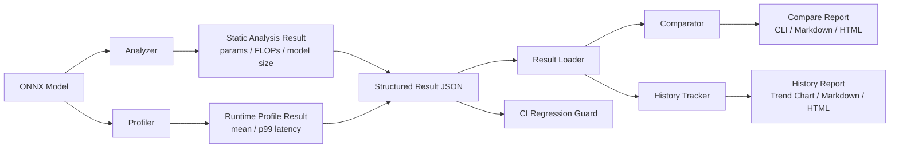
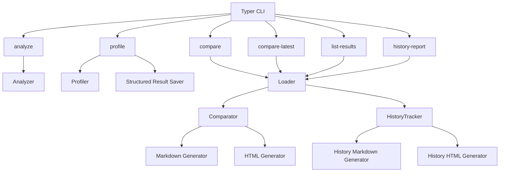

## 📌 프로젝트 개요

EdgeBench는 ONNX 기반 모델의 추론 성능을 분석하고,  
그 결과를 구조화하여 비교·추적·리포트화할 수 있는 CLI 기반 벤치마크 시스템입니다.

단순한 1회성 벤치마크가 아니라,  
지속적인 성능 추적과 회귀(regression) 감지가 가능하도록 설계되었습니다.

- Static analysis (Parameters, FLOPs)
- Runtime profiling (mean / p99 latency)
- Structured result 저장
- 결과 비교 및 히스토리 추적
- HTML / Markdown 리포트 생성
- CI 기반 성능 검증

---

## 🎯 문제 정의

Edge 환경에서는 모델의 accuracy보다 latency와 리소스 사용량이 더 중요한 지표입니다.

하지만 기존 방식은 다음과 같은 문제가 있었습니다:

- 벤치마크 결과가 일회성으로 끝남
- 이전 결과와 비교가 어려움
- 성능 변화 추적이 불가능
- CI 환경에서 자동 검증이 어려움

즉, "지속적으로 성능을 관리할 수 있는 구조"가 부족했습니다.

---

## ⚠️ 기존 방식의 한계

일반적인 벤치마크 방식은 다음과 같습니다:

- 모델 실행 → latency 측정 → 결과 출력

이 방식은 다음 문제를 가집니다:

- 결과 저장 구조가 없음
- 비교 기준이 없음
- 성능 개선 여부 판단 불가
- regression 발생 시 감지 불가능

결과적으로, 모델 성능 관리가 수작업에 의존하게 됩니다.

---

## 🧠 해결 방법

이 문제를 해결하기 위해 다음과 같은 시스템을 설계했습니다:

1. 모든 benchmark 결과를 structured JSON 형태로 저장
2. 동일 조건의 결과를 자동으로 비교
3. latency 변화량(delta, %) 계산
4. history 기반 성능 추세 추적
5. HTML / Markdown 리포트 자동 생성
6. CI에서 regression 자동 감지

이를 통해 단순 벤치마크가 아닌
"지속적인 성능 관리 시스템"을 구축했습니다.

---

## 🧩 시스템 아키텍처

### 전체 처리 흐름

### CLI 중심 모듈 구조

- Analyzer: 모델 구조 분석 (FLOPs, params)
- Profiler: 실제 추론 latency 측정
- Result Loader: structured 결과 로딩 및 정렬
- Comparator: 두 결과 비교 및 delta 계산
- History Tracker: 과거 결과 기반 추세 분석
- Report Generator:
  - HTML (시각화)
  - Markdown (문서화)
- CLI Interface (Typer)

전체 흐름:

Profile -> JSON 저장 -> Compare -> History -> Report -> CI 검증

---

## 🔧 핵심 기술 포인트

- ONNX Runtime 기반 추론 성능 측정
- structured result schema 설계
- CLI 인터페이스 설계 (Typer)
- HTML report generation (trend visualization)
- Markdown report generation (CI 활용)
- 결과 비교 알고리즘 (delta / % 계산)
- 동일 조건 자동 매칭 (model / engine / device / shape)
- Github Actions 기반 regression guard

---

## 📈 결과 및 성과

기존:

- 단일 실행 기반 벤치마크

개선 후:

- 성능을 지속적으로 추적 가능한 시스템 구축
- latency 변화 자동 분석
- regression 자동 감지 가능
- CI 기반 성능 검증 파이프라인 구축

결과적으로:

> 모델 성능을 "정량적으로 관리"할 수 있는 구조를 구현했습니다.

---

## 💡 배운 점

- 단순 기능 구현보다 "데이터 흐름 설계"가 중요하다는 것을 경험
- inference 성능은 단일 지표가 아니라 추세로 봐야 한다는 점 이해
- CLI UX와 개발자 경험(DevEx)의 중요성 체감
- CI와 결합했을 때 시스템의 가치가 크게 증가한다는 점 확인