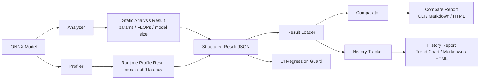
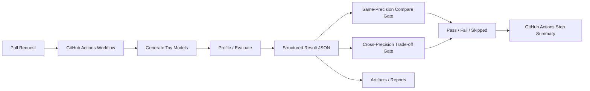
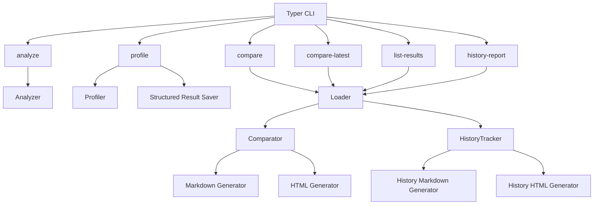

## 📌 프로젝트 개요

EdgeBench는 ONNX 기반 모델의 추론 성능을 분석하고,  
그 결과를 구조화하여 비교·추적·리포트화·CI 검증할 수 있는 CLI 기반 inference validation system입니다.

단순한 1회성 벤치마크가 아니라,  
지속적인 성능 추적, regression 감지, precision-aware 비교 해석,  
그리고 latency-accuracy trade-off validation이 가능하도록 설계되었습니다.

- Static analysis (Parameters, FLOPs)
- Runtime profiling (mean / p99 latency)
- Accuracy evaluation (top-1 classification)
- Structured result 저장
- same-precision / cross-precision 비교
- trade-off risk classification
- 최신 comparable pair 자동 선택
- HTML / Markdown 리포트 생성
- CI 기반 성능 검증 및 policy gate

---

## 🎯 문제 정의

Edge 환경에서는 단순 accuracy만으로 모델 배포 적합성을 판단할 수 없습니다.

실제 배포 관점에서는 다음 질문에 답할 수 있어야 합니다:

- 이 모델이 현재 장비에서 충분히 빠른가?
- 이전 버전 대비 성능이 나빠지지 않았는가?
- fp32 -> int8 변경 시 latency 이득이 실제로 의미 있는가?
- 그 이득이 accuracy 손실을 감수할 만큼 가치가 있는가?
- 이런 판단을 PR 단계에서 자동 검증할 수 있는가?

하지만 일반적인 벤치마크 방식은 이러한 질문에 체계적으로 답하지 못했습니다.
결과 저장 구조, 비교 기준, 정책 기반 해석, CI 연동이 분리되어 있었기 때문입니다.

이 문제의식은 실제 Edge HW 검증 경험에서 더 선명해졌습니다.
Jetson GPU와 Odroid RKNN NPU에서 fp16 / int8 quantization 결과를 반복적으로 비교할수록,
단순 latency 숫자만으로는 deployment 판단을 내릴 수 없었고,
실측 결과를 동일 schema로 저장한 뒤 accuracy trade-off까지 함께 해석하는 workflow가 반드시 필요하다는 점이 분명해졌습니다.

---

## ⚠️ 기존 방식의 한계

일반적인 벤치마크 방식은 다음과 같습니다:

- 모델 실행 → latency 측정 → 결과 출력

이 방식은 다음 문제를 가집니다:

- 결과 저장 구조가 없음
- 비교 기준이 없음
- 성능 개선 여부 판단 불가
- regression 발생 시 감지 불가능

결과적으로, 모델 성능 관리가 수작업에 의존하게 됩니다.

---

## 🧠 해결 방법

이 문제를 해결하기 위해 EdgeBench를 다음과 같은 validation workflow로 설계했습니다:

1. 모든 benchmark / evaluation 결과를 structured JSON 형태로 저장
2. model / engine / device / shape / precision 기준으로 comparable result 식별
3. latency와 accuracy를 함께 비교하는 accuracy-aware compare 로직 구축
4. same-precision compare와 cross-precision compare를 분리 해석
5. cross-precision 비교에 trade-off risk classification 도입
6. 최신 comparable pair 자동 선택 (`compare-latest`)
7. HTML / Markdown 리포트 자동 생성
8. CI에서 same-precision regression과 cross-precision severe trade-off 자동 검증
9. GitHub Action step summary로 결과를 PR UI에 바로 노출

이를 통해 EdgeBench는 단순 benchmark runner가 아니라
**지속적인 inference validation과 precision trade-off 해석이 가능한 시스템**으로 확장되었습니다.

또한 이 workflow는 ONNX Runtime CPU benchmark, Jetson TensorRT GPU 실측 결과, Odroid RKNN NPU curated detection 결과를 같은 result schema와 compare/report 흐름 안으로 흡수하도록 확장되었습니다.

---

## 🧩 시스템 아키텍처

### 전체 처리 흐름

### CI Validation Pipeline

이 CI 파이프라인을 통해 EdgeBench는 단순 benchmark 실행을 넘어서,
**회귀(regression) 검증과 precision trade-off 검증을 PR 단계에서 자동화**합니다.

### CLI 중심 모듈 구조

- Analyzer: 모델 구조 분석 (FLOPs, params)
- Profiler: 실제 추론 latency 측정
- Result Loader: structured 결과 로딩 및 정렬
- Comparator: 두 결과 비교 및 delta 계산
- History Tracker: 과거 결과 기반 추세 분석
- Report Generator:
  - HTML (시각화)
  - Markdown (문서화)
- CLI Interface (Typer)

전체 흐름:

Profile -> JSON 저장 -> Compare -> History -> Report -> CI 검증

---

## 🔧 핵심 기술 포인트

- ONNX Runtime 기반 추론 성능 측정
- classification manifest 기반 accuracy evaluation
- structured result schema 설계 
  (`model / engine / device / precision / shape / latency / system / run config`)
- CLI 인터페이스 설계 (Typer)
- HTML / Markdown compare report generation
- 결과 비교 알고리즘
  (latency delta / delta % / accuracy delta / delta pp)
- 동일 조건 자동 매칭
  (model / engine / device / precision / shape)
- latest comparable pair 자동 선택 로직
- same-precision regression semantics / cross-precision trade-off semantics 분리
- trade-off risk classification 설계
- threshold-configurable compare policy
- Github Actions 기반 regression / trade-off validation gate
- step summary 기반 PR-level benchmark explainability

---

## 📈 결과 및 성과

기존:

- 단일 실행 기반 벤치마크
- 이전 결과와의 비교가 수작업에 의존
- precision 차이에 따른 비교 해석 기준이 없음
- PR 단계에서 성능 변화 자동 검증이 어려움

개선 후:

- 성능을 지속적으로 추적 가능한 structured result system 구축
- latency 변화 자동 분석
- accuracy-aware compare 지원
- same-precision regression 자동 감지 가능
- cross-precision trade-off comparison 및 risk classification 지원
- 최신 comparable pair 자동 선택 기능 구현
- multi-size benchmark summary 제공
- CI 기반 성능 검증 및 Github Actions summary 연동

결과적으로:

> 모델 성능을 단순 측정하는 수준을 넘어,
> **비교·추적·해석·정책판단·CI 검증까지 가능한 inference validation workflow**를 구현했습니다.

### 수치 기반 Validation Evidence

- Jetson TensorRT 경로에서 `resnet18`, `yolov8n` profiling과 structured result 저장까지 실기 검증
- Jetson `resnet18` same-precision compare에서 mean latency `2.9544ms → 2.8265ms`, p99 `3.4980ms → 2.8929ms` 변화가 실제 **improvement** 로 판정되는 것을 확인
- Jetson `yolov8n` same-precision compare에서 mean latency `14.2246ms → 14.0697ms`, p99 `14.7342ms → 14.7342ms` 결과가 실제 **neutral** 로 판정되는 것을 확인
- structured result JSON 원문에서 `runtime_artifact_path`, `primary_input_name`, `resolved_input_shapes`, `effective_*` 필드 저장 확인
- Odroid M2 + YOLOv8n 기준 FP16 → Hybrid INT8 전환 시 mean latency `51.82ms → 16.29ms` 수준의 개선 확인
- 같은 RKNN detection 결과를 `map50` 중심 accuracy-aware compare에 연결하여, latency만 빠른 결과가 아니라 **accuracy 유지/개선 여부까지 함께 해석 가능한 구조**로 확장
- Odroid M2 실기 환경에서 `yolov8n.onnx` + `yolov8n_fp16.rknn` 조합의 RKNN runtime profiling 성공
- 같은 fp16 조건으로 repeated profiling 후 same-precision compare를 수행했고, mean latency `72.4249ms → 71.8846ms`, p99 `73.6221ms → 73.7026ms` 결과가 실제 **neutral** 로 판정되는 것을 확인

---

## 🧪 Real Edge Hardware Validation

EdgeBench는 실제 Edge Device 환경에서의 inference validation까지 확장되었습니다.

검증 환경:

- Jetson Orin Nano / TensorRT GPU execution path
- Odroid M1 (RK3568, NPU)
- Odroid M2 (RK3588, NPU)
- RKNN Toolkit 기반 inference pipeline

검증 모델:

- resnet18
- YOLOv8n
- YOLOv8s

검증 내용:

- FP16 vs INT8 (hybrid quantization) 비교
- 실제 NPU inference latency 측정
- detection accuracy (map50, F1 score) 수집
- structured result schema로 통합
- compare / compare-latest / report pipeline 재사용
- Jetson TensorRT same-precision profiling 반복 실행
- TensorRT result의 compare-latest / Markdown / HTML report 재사용 검증

Example:

- Jetson TensorRT (`resnet18`, fp16, batch1, 224x224)
  - mean latency: 2.9544ms → 2.8265ms
  - p99 latency: 3.4980ms → 2.8929ms
  - overall: improvement

- Jetson TensorRT (`yolov8n`, fp16, batch1, 640x640)
  - mean latency: 14.2246ms → 14.0697ms
  - p99 latency: 14.7342ms → 14.7342ms
  - overall: neutral

- YOLOv8n (Odroid M2, curated validation)
  - FP16 → Hybrid INT8
  - latency: 51.82ms → 16.29ms
  - map50: 0.7791 → 0.7977

- RKNN runtime (Odroid M2, `yolov8n.onnx`, fp16)
  - runtime artifact: `/home/odroid/rise/fp16/yolov8n_fp16.rknn`
  - mean latency: 72.4249ms → 71.8846ms
  - p99 latency: 73.6221ms → 73.7026ms
  - overall: neutral

- RKNN runtime (Odroid M2, `yolov8n.onnx`, fp16_vs_int8)
  - fp16 runtime artifact: `/home/odroid/rise/fp16/yolov8n_fp16.rknn`
  - int8 runtime artifact: `/home/odroid/rise/int8/yolov8n_hybrid_int8_boxdfl_scorefix.rknn`
  - mean latency: 71.8846ms → 35.0657ms
  - p99 latency: 73.7026ms → 35.6140ms
  - overall: tradeoff_faster
  - trade-off risk: unknown_risk

이 검증은 단순 curated import가 아니라,
실제 Odroid M2에서 RKNNLite runtime / `librknnrt.so` / `rknpu` kernel module을 연결한 뒤
EdgeBench의 `profile` 명령으로 직접 생성한 structured result를 다시 compare/report 흐름에 연결한 사례입니다.

또한 RKNNLite runtime metadata API 한계를 확인한 뒤,
원본 ONNX source metadata를 fallback으로 사용하는 방식으로 backend 호환성을 정리했습니다.
그 결과 RKNN backend도 TensorRT와 마찬가지로 EdgeBench의 공통 result schema와 report pipeline에 안정적으로 연결할 수 있게 되었습니다.

다만 해당 runtime cross-precision 검증 pair는 fp16과 int8 모델이 서로 다른 RKNN toolkit/compiler version에서 생성된 artifact를 사용했기 때문에,
관측된 latency 차이를 오직 precision 변화만의 효과로 단정해서는 안 됩니다.
따라서 본 결과는 “실기 runtime trade-off signal”로 해석하고,
동일 toolkit version 기준 pair 확보는 후속 정밀 검증 과제로 남겨두었습니다.

결과:

- 단순 benchmark 결과가 아닌  
  **실제 deployment 환경에서의 latency-accuracy trade-off 검증 가능**
- EdgeBench를 통해  
  **Edge inference 최적화 의사결정까지 지원 가능한 구조 완성**
- classification 전용이던 compare/report 계층을 detection-aware 구조로 확장하여,  
  RKNN detection 결과에서도 `map50`을 대표 accuracy metric으로 사용하고 `f1_score` 등 보조 metric을 함께 해석할 수 있게 했습니다.
- 특히 Odroid M2 YOLOv8n 사례에서는 Hybrid INT8 전환 시 latency가 크게 줄면서도 `map50`이 유지/개선되는 형태를 확인해, cross-precision compare의 실전 활용 가치를 보여주었습니다.
- Jetson TensorRT 경로에서는 repeated profiling 이후 same-precision compare 결과를 자동 판정하고,
  structured result JSON 원문에 runtime provenance까지 남기는 흐름을 검증했습니다.
- 그 결과 backend가 달라도, 실측 latency와 accuracy를 같은 judgement / report workflow 안에서 연결해 비교할 수 있는 validation system으로 정리했습니다.
- 즉, EdgeBench는 cross-precision trade-off 분석뿐 아니라, Jetson 실기 환경에서의 same-precision regression / improvement / neutral tracking까지 검증된 구조로 확장되었습니다.

---

## 💡 배운 점

- inference 성능은 단일 수치가 아니라 **비교 맥락과 해석 기준**이 함께 있어야 의미 있다는 점을 체감
- same-condition regression과 precision trade-off는 **판정 로직과 용어 자체가 달라야 한다**는 점을 학습
- 단순 benchmark 기능보다 **result schema와 validation workflow 설계**가 더 중요하다는 점을 경험
- CLI UX, 리포트, CI summary까지 포함해야 개발자 경험(DevEx)이 좋아진다는 점을 이해
- CI와 정책 기반 판단을 결합하면 benchmarking tool이 **실제 검증 시스템**으로 발전할 수 있다는 점을 확인
- benchmarking 도구를 실제 검증 시스템으로 발전시키려면, 측정 로직뿐 아니라 **정책(gate), 결과 표현(summary), 자동화(CI)**까지 함께 설계해야 한다는 점을 익힘
