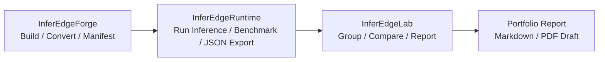

# InferEdge Pipeline Portfolio Summary

> Status note: this is an older portfolio summary kept as reference material.
> For the current source of truth, use [inferedge_pipeline_status.md](inferedge_pipeline_status.md),
> [inferedge_portfolio_submission.md](inferedge_portfolio_submission.md), and
> [inferedge_resume_interview_summary.md](inferedge_resume_interview_summary.md).

## 1. Project Summary

InferEdge is a portfolio project that now splits the edge AI inference workflow across four focused responsibilities:

- InferEdgeForge: prepares model artifacts, conversion outputs, manifests, and metadata.
- InferEdgeRuntime: runs inference on the target device, measures benchmark latency and FPS, and exports JSON results.
- InferEdgeLab: loads Runtime JSON results, groups them by `compare_key`, compares them by `backend_key`, and generates comparison reports.
- InferEdgeAIGuard: optionally adds deterministic rule/evidence diagnosis for provenance and failure signals.

This project demonstrates an end-to-end edge AI inference validation workflow from artifact preparation to runtime execution, Lab comparison/reporting, optional diagnosis evidence, and deployment decision support.

## How to Read This Portfolio

Use this document as the project-level overview.
For the detailed real-input benchmark evidence, read [runtime_compare_yolov8n.md](runtime_compare_yolov8n.md).
For a compact submission draft, use [inferedge_pipeline_portfolio_pdf.md](inferedge_pipeline_portfolio_pdf.md).
For measurement interpretation and limitations, read [benchmark_policy.md](../benchmark_policy.md).

## 2. Problem Definition

In edge AI deployment, converting a model or running one inference command is not enough.
A deployment workflow also needs to answer whether the result is reproducible, comparable, and explainable.

The key problems are:

- Different backends can show very different latency characteristics.
- Different devices have different performance profiles and runtime overheads.
- Dummy benchmarks and real image input benchmarks must be interpreted separately.
- Results should be saved as reproducible JSON and reports, not only terminal logs.
- Hardware acceleration results need to be explained in a way that is understandable to reviewers and deployment stakeholders.

## 3. System Architecture

```text
InferEdgeForge
  -> build / convert / manifest
InferEdgeRuntime
  -> load model or engine
  -> run dummy or real image input inference
  -> measure latency / FPS
  -> export compare-ready JSON
InferEdgeLab
  -> load Runtime JSON
  -> group by compare_key
  -> compare by backend_key
  -> export Markdown report
```



Runtime measures. Lab compares. Portfolio documents explain the evidence.

The responsibility boundary is intentional.
Runtime focuses on measurement, while Lab focuses on analysis, comparison, and reporting.
This keeps target-device execution code separate from portfolio/reporting logic.

## 4. Runtime Benchmark Workflow

The benchmark workflow is:

1. Prepare the model artifact through Forge or a local model artifact flow.
2. Select an InferEdgeRuntime backend such as ONNX Runtime CPU or TensorRT.
3. Select dummy input or real image input.
4. Measure latency mean, p99, and FPS in Runtime.
5. Export compare-ready JSON with `compare_key` and `backend_key`.
6. Load the JSON files in InferEdgeLab and generate a backend comparison report.

`compare_key` identifies the comparison group for the same model, input shape, and precision.
`backend_key` identifies the actual backend and device combination, such as `onnxruntime__cpu` or `tensorrt__jetson`.

## 5. Current Local Studio Demo Evidence

The current Local Studio demo evidence uses bundled Runtime result fixtures so the comparison can be replayed in a browser without a live Jetson session:

- Model: YOLOv8n
- Input Shape: `1x3x640x640`
- ONNX baseline `compare_key`: `yolov8n__b1__h640w640__fp32`
- TensorRT candidate `compare_key`: `yolov8n__b1__h640w640__fp16`
- TensorRT power mode: `25W`

| Backend | Precision | Power Mode | Mean ms | P95 ms | P99 ms | FPS | Status |
|---|---|---|---:|---:|---:|---:|---|
| TensorRT Jetson | FP16 | 25W | 10.066401 | 15.476641 | 15.548438 | 99.340373 | success |
| ONNX Runtime CPU | FP32 | n/a | 45.4299 | n/a | 49.2128 | 22.0119 | success |

- Total compare groups: 1
- Comparable groups count: 1
- Skipped groups count: 0
- Fastest backend: `tensorrt__jetson`
- Slowest backend: `onnxruntime__cpu`
- Speedup ratio: about `4.51x`
- ONNX Runtime CPU is about 4.51x slower than TensorRT Jetson FP16 25W for this demo pair.

The Runtime latency is end-to-end wall-clock latency and should not be directly compared with trtexec GPU-only latency.
The historical OpenCV real-image input benchmark remains documented in `runtime_compare_yolov8n.md`, while Local Studio now uses the explicit FP16/25W evidence fixture above.

## 6. Technical Contribution

The project demonstrates the following technical work:

- C++ Runtime CLI design for repeatable inference benchmarking.
- ONNX Runtime CPU backend benchmarking.
- TensorRT Jetson backend benchmarking.
- OpenCV real image input preprocessing.
- Structured JSON result schema for benchmark outputs.
- `compare_key` and `backend_key` metadata design for automatic grouping.
- InferEdgeLab automatic grouping and backend comparison.
- Markdown report export for portfolio-ready result summaries.
- Benchmark policy documentation for dummy input, real image input, Runtime latency, and trtexec latency interpretation.

## 7. What This Proves

From a hiring perspective, this project shows that I can:

- Validate real TensorRT execution on an edge device.
- Store inference latency as structured data instead of one-off terminal logs.
- Design comparable backend metadata and automate comparison.
- Separate Runtime measurement responsibilities from Lab analysis and reporting responsibilities.
- Verify results using real image input, not only dummy tensors.

## 8. Interview Talking Points

- "I did not only run YOLOv8n; I built a validation pipeline that goes from Runtime JSON to Lab comparison reports."
- "Using the same `compare_key`, I compared ONNX Runtime CPU and TensorRT Jetson, and TensorRT was 4.6x faster with real image input."
- "Runtime latency is measured end to end, so I separated the benchmark policy from trtexec GPU latency."
- "Runtime focuses on measurement, while Lab focuses on comparison and reporting. That separation keeps the system easier to extend."

## 9. Related Documents

- [YOLOv8n Runtime backend comparison](runtime_compare_yolov8n.md)
- [Benchmark policy](../benchmark_policy.md)
- [README](../../README.md)
